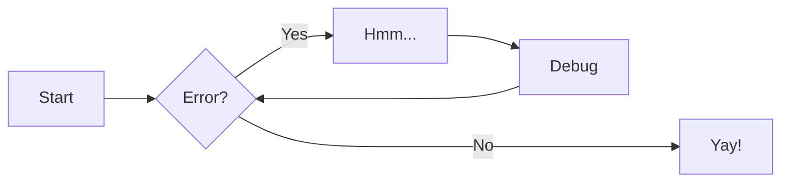
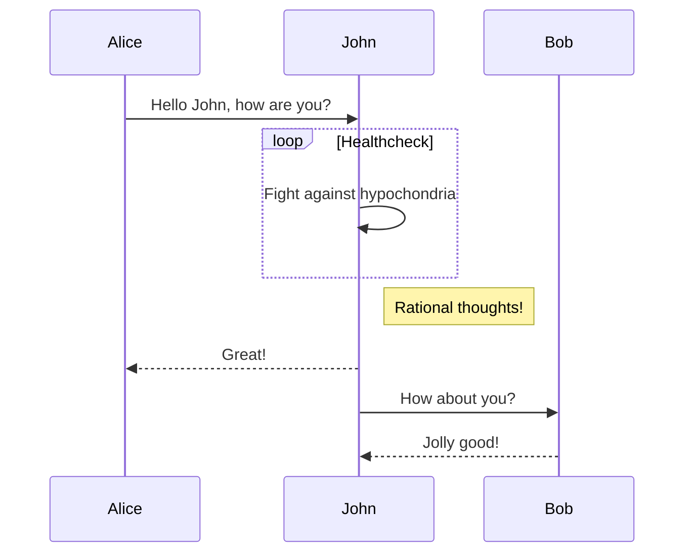

!!!info
    测试中的小组件，可看源代码自行取用

<center><font  color= #518FC1 size=6 class="ml3">“循此苦旅 以达星辰”</font></center>
<script src="https://cdnjs.cloudflare.com/ajax/libs/animejs/2.0.2/anime.min.js"></script>


<div class="grid" style="display: grid;grid-template-columns: 30% 69%" markdown>
<div class="grid cards" markdown>

-   :material-tooltip-edit:{ .lg .middle } __关于__

    ---    
    - [效率][Software]
    [Software]: javascript:document.getElementById('software').scrollIntoView()

</div>

<div class="grid cards" style="display: grid; grid-template-columns: 1fr;" markdown>

-   :material-star-shooting:{ .lg .middle } __推荐__

    ---

    :material-eye-check:{ .lg .middle } [Wcowin](https://github.com/Wcowin/Wcowin.github.io) - 技术博客

<div class="grid cards" style="display:grid; grid-template-columns: 49% 49% !important;" markdown>


-   :material-file-link:{ .lg .middle } __Release__

    ---

    更新中...

    [→ 所有版本](https://github.com/Wcowin/Wcowin.github.io)


-   :material-flag-variant-minus:{ .lg .middle } __Wcowin__

    ---

    更新中...

    [→ 了解更多](https://github.com/Wcowin/Wcowin.github.io)

</div>

</div>

</div>

<!-- <font  color= #518FC1 size=6 class="fontalicious">“循此苦旅，以达星辰”</font> -->

<!-- <div class="spinner">
  <div class="rect1"></div>
  <div class="rect2"></div>
  <div class="rect3"></div>
  <div class="rect4"></div>
  <div class="rect5"></div>
</div> -->

<!-- { loading=lazy } -->
<figure markdown>
  { width="300" }
  <figcaption>Image caption</figcaption>
</figure>

<font face="宋体"  size=80>:flag_cn:<b></font>  

$\overset{wáng}{王}\overset{kē}{科}\overset{wén}{文}$

- H~2~O
- A^T^A
- ==This was marked==
- ^^This was inserted^^
- ~~This was deleted~~


[](#)


<!DOCTYPE html>
<html lang="en">
  <head>
    <meta charset="UTF-8" />
    <meta name="viewport" content="width=device-width" />
    <link
          rel="stylesheet"
          href="https://cdn.jsdelivr.net/npm/@fancyapps/ui@5.0/dist/fancybox/fancybox.css"
          />
  </head>
  <body>
    <div>
      <a
         data-fancybox="gallery"
         data-src="https://lipsum.app/id/2/1024x768"
         data-caption="Optional caption,&lt;br /&gt;that can contain &lt;em&gt;HTML&lt;/em&gt; code"
         >
        
      </a>
      <a data-fancybox="gallery" data-src="https://lipsum.app/id/3/1024x768">
        
      </a>
      <a data-fancybox="gallery" data-src="https://lipsum.app/id/4/1024x768">
        
      </a>
    </div>
    <script src="https://cdn.jsdelivr.net/npm/@fancyapps/ui@5.0/dist/fancybox/fancybox.umd.js"></script>
    <script>
      Fancybox.bind('[data-fancybox="gallery"]', {
        //
      });    
    </script>
  </body>
</html>

<!-- [](https://github.com/anuraghazra/github-readme-stats) -->

</p><h1 id="01" name="01"><strong>01</strong></h1><p>

<div class="grid cards" markdown>

- :fontawesome-brands-html5: __HTML__ for content and structure
- :fontawesome-brands-js: __JavaScript__ for interactivity
- :fontawesome-brands-css3: __CSS__ for text running out of boxes
- :fontawesome-brands-internet-explorer: __Internet Explorer__ ... huh?

</div>

<div class="grid cards" markdown>

-   :material-clock-fast:{ .lg .middle } __Set up in 5 minutes__

    ---

    Install [`mkdocs-material`](#) with [`pip`](#) and get up
    and running in minutes

    [:octicons-arrow-right-24: Getting started](#)

-   :fontawesome-brands-markdown:{ .lg .middle } __It's just Markdown__

    ---

    Focus on your content and generate a responsive and searchable static site

    [:octicons-arrow-right-24: Reference](#)

-   :material-format-font:{ .lg .middle } __Made to measure__

    ---

    Change the colors, fonts, language, icons, logo and more with a few lines

    [:octicons-arrow-right-24: Customization](#)

-   :material-scale-balance:{ .lg .middle } __Open Source, MIT__

    ---

    Material for MkDocs is licensed under MIT and available on [GitHub]

    [:octicons-arrow-right-24: License](#)

</div>

<p>这是测试<span class="mask">并且被掩盖的</span>文字！</p>

<div id="ww_a25897805c222" v='1.3' loc='auto' a='{"t":"responsive","lang":"zh","sl_lpl":1,"ids":[],"font":"Times","sl_ics":"one_a","sl_sot":"celsius","cl_bkg":"image","cl_font":"#FFFFFF","cl_cloud":"#FFFFFF","cl_persp":"#81D4FA","cl_sun":"#FFC107","cl_moon":"#FFC107","cl_thund":"#FF5722","sl_tof":"5"}'><a href="https://weatherwidget.org/zh/" id="ww_a25897805c222_u" target="_blank">天气插件</a></div><script async src="https://app2.weatherwidget.org/js/?id=ww_a25897805c222"></script>

***

=== "C"

    ``` c
    #include <stdio.h>

    int main(void) {
      printf("Hello world!\n");
      return 0;
    }
    ```

=== "C++"

    ``` c++
    #include <iostream>

    int main(void) {
      std::cout << "Hello world!" << std::endl;
      return 0;
    }
    ```

``` py hl_lines="2 3"
def bubble_sort(items):
    for i in range(len(items)):
        for j in range(len(items) - 1 - i):
            if items[j] > items[j + 1]:
                items[j], items[j + 1] = items[j + 1], items[j]
```

***
!!! note

    Lorem ipsum dolor sit amet, consectetur adipiscing elit. Nulla et euismod
    nulla. Curabitur feugiat, tortor non consequat finibus, justo purus auctor
    massa, nec semper lorem quam in massa.

!!! note "Phasellus posuere in sem ut cursus"

    Lorem ipsum dolor sit amet, consectetur adipiscing elit. Nulla et euismod
    nulla. Curabitur feugiat, tortor non consequat finibus, justo purus auctor
    massa, nec semper lorem quam in massa.

??? Tip

    Lorem ipsum dolor sit amet, consectetur adipiscing elit. Nulla et euismod
    nulla. Curabitur feugiat, tortor non consequat finibus, justo purus auctor
    massa, nec semper lorem quam in massa.

!!! info inline end

    Lorem ipsum dolor sit amet, consectetur
    adipiscing elit. Nulla et euismod nulla.
    Curabitur feugiat, tortor non consequat
    finibus, justo purus auctor massa, nec
    semper lorem quam in massa.


***
[Subscribe to our newsletter](#){ .md-button }

[Send :fontawesome-solid-paper-plane:](mailto:<1135801806@qq.com>){ .md-button }

| Method      | Description                          |
| ----------- | ------------------------------------ |
| `GET`       | :material-check:     Fetch resource  |
| `PUT`       | :material-check-all: Update resource |
| `DELETE`    | :material-close:     Delete resource |

***

- [x] Lorem ipsum dolor sit amet, consectetur adipiscing elit
- [ ] Vestibulum convallis sit amet nisi a tincidunt
    * [x] In hac habitasse platea dictumst
    * [x] In scelerisque nibh non dolor mollis congue sed et metus
    * [ ] Praesent sed risus massa
- [ ] Aenean pretium efficitur erat, donec pharetra, ligula non scelerisque


$$
\operatorname{ker} f=\{g\in G:f(g)=e_{H}\}{\mbox{.}}
$$

<!-- { data-title="Madeira, Portugal." data-description="Madeira, an autonomous region of Portugal, is an archipelago comprising 4 islands off the northwest coast of Africa. - Google" } -->

左对齐，右对齐  
{ align=left }


<figure markdown>
  { width="300" }
  <figcaption>图片说明</figcaption>
</figure>

**明暗**







!!! pied-piper "Pied Piper"

    Lorem ipsum dolor sit amet, consectetur adipiscing elit. Nulla et
    euismod nulla. Curabitur feugiat, tortor non consequat finibus, justo
    purus auctor massa, nec semper lorem quam in massa.

++ctrl+alt+del++  


:octicons-arrow-right-24: [点我回到顶部](#) 

[Hover me][example]

  [example]: https://example.com "I'm a tooltip!"


[Hover me](https://example.com "I'm a tooltip!")

The HTML specification is maintained by the W3C.

*[HTML]: Hyper Text Markup Language
*[W3C]: World Wide Web Consortium


:fontawesome-brands-twitter:{ .twitter }

<script src="https://cdn.jsdelivr.net/gh/dixonandmoe/rellax@master/rellax.min.js"></script>

``` py hl_lines="2 3"
def bubble_sort(items):
    for i in range(len(items)):
        for j in range(len(items) - 1 - i):
            if items[j] > items[j + 1]:
                items[j], items[j + 1] = items[j + 1], items[j]
```
``` py linenums="1"
def bubble_sort(items):
    for i in range(len(items)):
        for j in range(len(items) - 1 - i):
            if items[j] > items[j + 1]:
                items[j], items[j + 1] = items[j + 1], items[j]
```
``` title=".browserslistrc"
--8<-- ".browserslistrc"
Wcowin
```


  <body>
    <pre class="mermaid">
  graph LR
      A --- B
      B-->C[fa:fa-ban forbidden]
      B-->D(fa:fa-spinner);
    </pre>

  </body>


来看看两个重要极限  

$$\displaystyle\lim_{x \rightarrow 0}\frac{\sin x}{x} = 1$$

$$\displaystyle\lim_{x \rightarrow + \infty}(1 + \frac{1}{x})^x = e$$


<!-- <link type="text/css" rel="stylesheet" href="/ckplayer/css/ckplayer.css" />
<script type="text/javascript" src="/ckplayer/js/ckplayer.js" charset="UTF-8"></script>
<div class="video" style="width: 640px;height: 500px;">播放器容器</div>
<script type="text/javascript">
    //定义一个变量：videoObject，用来做为视频初始化配置
    var videoObject = {
        container: '.video', //“#”代表容器的ID，“.”或“”代表容器的class
        smallWindows:null,//是否启用小窗口模式
        poster: 'https://cdn.cnbj1.fds.api.mi-img.com/mi-mall/c6f46fb63c119d83d2b4b38505fffbcd.jpg?w=1226&h=450',//封面图片地址
        webFull:true,//是否启用页面全屏按钮，默认不启用
        video: 'https://cdn.cnbj1.fds.api.mi-img.com/staticsfile/pc/about/struggle.mp4'//视频地址
    };
    var player = new ckplayer(videoObject);//初始化播放器
</script>   -->

***  

<div id="grad1"></div>

<button class="buttoncss">按钮</button>
 <button class="buttonxuan buttonxuan1">Green</button>

 <div class="hide">我是会隐藏的元素。</div>  
 
***  

 <div class="grid-container">
  <div class="item1">头部</div>
  <div class="item2">菜单</div>
  <div class="item3">主要内容区域</div>  
  <div class="item4">右侧</div>
  <div class="item5">底部</div>
</div>


<p>
这是一个电子邮件链接：
<a href="mailto:wangkewen821@gmail.com?Subject=Hello%20Wcowin" target="_top">
发送邮件</a>
</p>

<table border="1">
<tr>
  <td>100</td>
  <td>200</td>
  <td>300</td>
</tr>
<tr>
  <td>400</td>
  <td>500</td>
  <td>600</td>
</tr>
</table>

<table border="1" width="100%">
    <tbody><tr>
      <td align="center" style="color:#ffffff" bgcolor="#000000">000000</td>
      <td align="center" style="color:#ffffff" bgcolor="#000033">000033</td>
      <td align="center" style="color:#ffffff" bgcolor="#000066">000066</td>
      <td align="center" style="color:#ffffff" bgcolor="#000099">000099</td>
      <td align="center" style="color:#ffffff" bgcolor="#0000cc">0000CC</td>
      <td align="center" style="color:#ffffff" bgcolor="#0000ff">0000FF</td>
    </tr>
    <tr>
      <td align="center" style="color:#ffffff" bgcolor="#003300">003300</td>
      <td align="center" style="color:#ffffff" bgcolor="#003333">003333</td>
      <td align="center" style="color:#ffffff" bgcolor="#003366">003366</td>
      <td align="center" style="color:#ffffff" bgcolor="#003399">003399</td>
      <td align="center" style="color:#ffffff" bgcolor="#0033cc">0033CC</td>
      <td align="center" style="color:#ffffff" bgcolor="#0033ff">0033FF</td>
    </tr>
    <tr>
      <td align="center" style="color:#ffffff" bgcolor="#006600">006600</td>
      <td align="center" style="color:#ffffff" bgcolor="#006633">006633</td>
      <td align="center" style="color:#ffffff" bgcolor="#006666">006666</td>
      <td align="center" style="color:#ffffff" bgcolor="#006699">006699</td>
      <td align="center" style="color:#ffffff" bgcolor="#0066cc">0066CC</td>
      <td align="center" style="color:#ffffff" bgcolor="#0066ff">0066FF</td>
    </tr>
    <tr>
      <td align="center" bgcolor="#009900">009900</td>
      <td align="center" bgcolor="#009933">009933</td>
      <td align="center" bgcolor="#009966">009966</td>
      <td align="center" bgcolor="#009999">009999</td>
      <td align="center" bgcolor="#0099cc">0099CC</td>
      <td align="center" bgcolor="#0099ff">0099FF</td>
    </tr>
    <tr>
      <td align="center" bgcolor="#00cc00">00CC00</td>
      <td align="center" bgcolor="#00cc33">00CC33</td>
      <td align="center" bgcolor="#00cc66">00CC66</td>
      <td align="center" bgcolor="#00cc99">00CC99</td>
      <td align="center" bgcolor="#00cccc">00CCCC</td>
      <td align="center" bgcolor="#00ccff">00CCFF</td>
    </tr>
    <tr>
      <td align="center" bgcolor="#00ff00">00FF00</td>
      <td align="center" bgcolor="#00ff33">00FF33</td>
      <td align="center" bgcolor="#00ff66">00FF66</td>
      <td align="center" bgcolor="#00ff99">00FF99</td>
      <td align="center" bgcolor="#00ffcc">00FFCC</td>
      <td align="center" bgcolor="#00ffff">00FFFF</td>
    </tr>
    <tr>
      <td align="center" style="color:#ffffff" bgcolor="#330000">330000</td>
      <td align="center" style="color:#ffffff" bgcolor="#330033">330033</td>
      <td align="center" style="color:#ffffff" bgcolor="#330066">330066</td>
      <td align="center" style="color:#ffffff" bgcolor="#330099">330099</td>
      <td align="center" style="color:#ffffff" bgcolor="#3300cc">3300CC</td>
      <td align="center" style="color:#ffffff" bgcolor="#3300ff">3300FF</td>
    </tr>
    <tr>
      <td align="center" style="color:#ffffff" bgcolor="#333300">333300</td>
      <td align="center" style="color:#ffffff" bgcolor="#333333">333333</td>
      <td align="center" style="color:#ffffff" bgcolor="#333366">333366</td>
      <td align="center" style="color:#ffffff" bgcolor="#333399">333399</td>
      <td align="center" style="color:#ffffff" bgcolor="#3333cc">3333CC</td>
      <td align="center" style="color:#ffffff" bgcolor="#3333ff">3333FF</td>
    </tr>
    <tr>
      <td align="center" style="color:#ffffff" bgcolor="#336600">336600</td>
      <td align="center" style="color:#ffffff" bgcolor="#336633">336633</td>
      <td align="center" style="color:#ffffff" bgcolor="#336666">336666</td>
      <td align="center" style="color:#ffffff" bgcolor="#336699">336699</td>
      <td align="center" style="color:#ffffff" bgcolor="#3366cc">3366CC</td>
      <td align="center" style="color:#ffffff" bgcolor="#3366ff">3366FF</td>
    </tr>
    <tr>
      <td align="center" bgcolor="#339900">339900</td>
      <td align="center" bgcolor="#339933">339933</td>
      <td align="center" bgcolor="#339966">339966</td>
      <td align="center" bgcolor="#339999">339999</td>
      <td align="center" bgcolor="#3399cc">3399CC</td>
      <td align="center" bgcolor="#3399ff">3399FF</td>
    </tr>
    <tr>
      <td align="center" bgcolor="#33cc00">33CC00</td>
      <td align="center" bgcolor="#33cc33">33CC33</td>
      <td align="center" bgcolor="#33cc66">33CC66</td>
      <td align="center" bgcolor="#33cc99">33CC99</td>
      <td align="center" bgcolor="#33cccc">33CCCC</td>
      <td align="center" bgcolor="#33ccff">33CCFF</td>
    </tr>
    <tr>
      <td align="center" bgcolor="#33ff00">33FF00</td>
      <td align="center" bgcolor="#33ff33">33FF33</td>
      <td align="center" bgcolor="#33ff66">33FF66</td>
      <td align="center" bgcolor="#33ff99">33FF99</td>
      <td align="center" bgcolor="#33ffcc">33FFCC</td>
      <td align="center" bgcolor="#33ffff">33FFFF</td>
    </tr>
    <tr>
      <td align="center" style="color:#ffffff" bgcolor="#660000">660000</td>
      <td align="center" style="color:#ffffff" bgcolor="#660033">660033</td>
      <td align="center" style="color:#ffffff" bgcolor="#660066">660066</td>
      <td align="center" style="color:#ffffff" bgcolor="#660099">660099</td>
      <td align="center" style="color:#ffffff" bgcolor="#6600cc">6600CC</td>
      <td align="center" style="color:#ffffff" bgcolor="#6600ff">6600FF</td>
    </tr>
    <tr>
      <td align="center" style="color:#ffffff" bgcolor="#663300">663300</td>
      <td align="center" style="color:#ffffff" bgcolor="#663333">663333</td>
      <td align="center" style="color:#ffffff" bgcolor="#663366">663366</td>
      <td align="center" style="color:#ffffff" bgcolor="#663399">663399</td>
      <td align="center" style="color:#ffffff" bgcolor="#6633cc">6633CC</td>
      <td align="center" style="color:#ffffff" bgcolor="#6633ff">6633FF</td>
    </tr>
    <tr>
      <td align="center" style="color:#ffffff" bgcolor="#666600">666600</td>
      <td align="center" style="color:#ffffff" bgcolor="#666633">666633</td>
      <td align="center" style="color:#ffffff" bgcolor="#666666">666666</td>
      <td align="center" style="color:#ffffff" bgcolor="#666699">666699</td>
      <td align="center" style="color:#ffffff" bgcolor="#6666cc">6666CC</td>
      <td align="center" style="color:#ffffff" bgcolor="#6666ff">6666FF</td>
    </tr>
    <tr>
      <td align="center" bgcolor="#669900">669900</td>
      <td align="center" bgcolor="#669933">669933</td>
      <td align="center" bgcolor="#669966">669966</td>
      <td align="center" bgcolor="#669999">669999</td>
      <td align="center" bgcolor="#6699cc">6699CC</td>
      <td align="center" bgcolor="#6699ff">6699FF</td>
    </tr>
    <tr>
      <td align="center" bgcolor="#66cc00">66CC00</td>
      <td align="center" bgcolor="#66cc33">66CC33</td>
      <td align="center" bgcolor="#66cc66">66CC66</td>
      <td align="center" bgcolor="#66cc99">66CC99</td>
      <td align="center" bgcolor="#66cccc">66CCCC</td>
      <td align="center" bgcolor="#66ccff">66CCFF</td>
    </tr>
    <tr>
      <td align="center" bgcolor="#66ff00">66FF00</td>
      <td align="center" bgcolor="#66ff33">66FF33</td>
      <td align="center" bgcolor="#66ff66">66FF66</td>
      <td align="center" bgcolor="#66ff99">66FF99</td>
      <td align="center" bgcolor="#66ffcc">66FFCC</td>
      <td align="center" bgcolor="#66ffff">66FFFF</td>
    </tr>
    <tr>
      <td align="center" style="color:#ffffff" bgcolor="#990000">990000</td>
      <td align="center" style="color:#ffffff" bgcolor="#990033">990033</td>
      <td align="center" style="color:#ffffff" bgcolor="#990066">990066</td>
      <td align="center" style="color:#ffffff" bgcolor="#990099">990099</td>
      <td align="center" style="color:#ffffff" bgcolor="#9900cc">9900CC</td>
      <td align="center" style="color:#ffffff" bgcolor="#9900ff">9900FF</td>
    </tr>
    <tr>
      <td align="center" style="color:#ffffff" bgcolor="#993300">993300</td>
      <td align="center" style="color:#ffffff" bgcolor="#993333">993333</td>
      <td align="center" style="color:#ffffff" bgcolor="#993366">993366</td>
      <td align="center" style="color:#ffffff" bgcolor="#993399">993399</td>
      <td align="center" style="color:#ffffff" bgcolor="#9933cc">9933CC</td>
      <td align="center" style="color:#ffffff" bgcolor="#9933ff">9933FF</td>
    </tr>
    <tr>
      <td align="center" style="color:#ffffff" bgcolor="#996600">996600</td>
      <td align="center" style="color:#ffffff" bgcolor="#996633">996633</td>
      <td align="center" style="color:#ffffff" bgcolor="#996666">996666</td>
      <td align="center" style="color:#ffffff" bgcolor="#996699">996699</td>
      <td align="center" style="color:#ffffff" bgcolor="#9966cc">9966CC</td>
      <td align="center" style="color:#ffffff" bgcolor="#9966ff">9966FF</td>
    </tr>
    <tr>
      <td align="center" bgcolor="#999900">999900</td>
      <td align="center" bgcolor="#999933">999933</td>
      <td align="center" bgcolor="#999966">999966</td>
      <td align="center" bgcolor="#999999">999999</td>
      <td align="center" bgcolor="#9999cc">9999CC</td>
      <td align="center" bgcolor="#9999ff">9999FF</td>
    </tr>
    <tr>
      <td align="center" bgcolor="#99cc00">99CC00</td>
      <td align="center" bgcolor="#99cc33">99CC33</td>
      <td align="center" bgcolor="#99cc66">99CC66</td>
      <td align="center" bgcolor="#99cc99">99CC99</td>
      <td align="center" bgcolor="#99cccc">99CCCC</td>
      <td align="center" bgcolor="#99ccff">99CCFF</td>
    </tr>
    <tr>
      <td align="center" bgcolor="#99ff00">99FF00</td>
      <td align="center" bgcolor="#99ff33">99FF33</td>
      <td align="center" bgcolor="#99ff66">99FF66</td>
      <td align="center" bgcolor="#99ff99">99FF99</td>
      <td align="center" bgcolor="#99ffcc">99FFCC</td>
      <td align="center" bgcolor="#99ffff">99FFFF</td>
    </tr>
    <tr>
      <td align="center" style="color:#ffffff" bgcolor="#cc0000">CC0000</td>
      <td align="center" style="color:#ffffff" bgcolor="#cc0033">CC0033</td>
      <td align="center" style="color:#ffffff" bgcolor="#cc0066">CC0066</td>
      <td align="center" style="color:#ffffff" bgcolor="#cc0099">CC0099</td>
      <td align="center" style="color:#ffffff" bgcolor="#cc00cc">CC00CC</td>
      <td align="center" style="color:#ffffff" bgcolor="#cc00ff">CC00FF</td>
    </tr>
    <tr>
      <td align="center" style="color:#ffffff" bgcolor="#cc3300">CC3300</td>
      <td align="center" style="color:#ffffff" bgcolor="#cc3333">CC3333</td>
      <td align="center" style="color:#ffffff" bgcolor="#cc3366">CC3366</td>
      <td align="center" style="color:#ffffff" bgcolor="#cc3399">CC3399</td>
      <td align="center" style="color:#ffffff" bgcolor="#cc33cc">CC33CC</td>
      <td align="center" style="color:#ffffff" bgcolor="#cc33ff">CC33FF</td>
    </tr>
    <tr>
      <td align="center" style="color:#ffffff" bgcolor="#cc6600">CC6600</td>
      <td align="center" style="color:#ffffff" bgcolor="#cc6633">CC6633</td>
      <td align="center" style="color:#ffffff" bgcolor="#cc6666">CC6666</td>
      <td align="center" style="color:#ffffff" bgcolor="#cc6699">CC6699</td>
      <td align="center" style="color:#ffffff" bgcolor="#cc66cc">CC66CC</td>
      <td align="center" style="color:#ffffff" bgcolor="#cc66ff">CC66FF</td>
    </tr>
    <tr>
      <td align="center" bgcolor="#cc9900">CC9900</td>
      <td align="center" bgcolor="#cc9933">CC9933</td>
      <td align="center" bgcolor="#cc9966">CC9966</td>
      <td align="center" bgcolor="#cc9999">CC9999</td>
      <td align="center" bgcolor="#cc99cc">CC99CC</td>
      <td align="center" bgcolor="#cc99ff">CC99FF</td>
    </tr>
    <tr>
      <td align="center" bgcolor="#cccc00">CCCC00</td>
      <td align="center" bgcolor="#cccc33">CCCC33</td>
      <td align="center" bgcolor="#cccc66">CCCC66</td>
      <td align="center" bgcolor="#cccc99">CCCC99</td>
      <td align="center" bgcolor="#cccccc">CCCCCC</td>
      <td align="center" bgcolor="#ccccff">CCCCFF</td>
    </tr>
    <tr>
      <td align="center" bgcolor="#ccff00">CCFF00</td>
      <td align="center" bgcolor="#ccff33">CCFF33</td>
      <td align="center" bgcolor="#ccff66">CCFF66</td>
      <td align="center" bgcolor="#ccff99">CCFF99</td>
      <td align="center" bgcolor="#ccffcc">CCFFCC</td>
      <td align="center" bgcolor="#ccffff">CCFFFF</td>
    </tr>
    <tr>
      <td align="center" style="color:#ffffff" bgcolor="#ff0000">FF0000</td>
      <td align="center" style="color:#ffffff" bgcolor="#ff0033">FF0033</td>
      <td align="center" style="color:#ffffff" bgcolor="#ff0066">FF0066</td>
      <td align="center" style="color:#ffffff" bgcolor="#ff0099">FF0099</td>
      <td align="center" style="color:#ffffff" bgcolor="#ff00cc">FF00CC</td>
      <td align="center" style="color:#ffffff" bgcolor="#ff00ff">FF00FF</td>
    </tr>
    <tr>
      <td align="center" style="color:#ffffff" bgcolor="#ff3300">FF3300</td>
      <td align="center" style="color:#ffffff" bgcolor="#ff3333">FF3333</td>
      <td align="center" style="color:#ffffff" bgcolor="#ff3366">FF3366</td>
      <td align="center" style="color:#ffffff" bgcolor="#ff3399">FF3399</td>
      <td align="center" style="color:#ffffff" bgcolor="#ff33cc">FF33CC</td>
      <td align="center" style="color:#ffffff" bgcolor="#ff33ff">FF33FF</td>
    </tr>
    <tr>
      <td align="center" style="color:#ffffff" bgcolor="#ff6600">FF6600</td>
      <td align="center" style="color:#ffffff" bgcolor="#ff6633">FF6633</td>
      <td align="center" style="color:#ffffff" bgcolor="#ff6666">FF6666</td>
      <td align="center" style="color:#ffffff" bgcolor="#ff6699">FF6699</td>
      <td align="center" style="color:#ffffff" bgcolor="#ff66cc">FF66CC</td>
      <td align="center" style="color:#ffffff" bgcolor="#ff66ff">FF66FF</td>
    </tr>
    <tr>
      <td align="center" bgcolor="#ff9900">FF9900</td>
      <td align="center" bgcolor="#ff9933">FF9933</td>
      <td align="center" bgcolor="#ff9966">FF9966</td>
      <td align="center" bgcolor="#ff9999">FF9999</td>
      <td align="center" bgcolor="#ff99cc">FF99CC</td>
      <td align="center" bgcolor="#ff99ff">FF99FF</td>
    </tr>
    <tr>
      <td align="center" bgcolor="#ffcc00">FFCC00</td>
      <td align="center" bgcolor="#ffcc33">FFCC33</td>
      <td align="center" bgcolor="#ffcc66">FFCC66</td>
      <td align="center" bgcolor="#ffcc99">FFCC99</td>
      <td align="center" bgcolor="#ffcccc">FFCCCC</td>
      <td align="center" bgcolor="#ffccff">FFCCFF</td>
    </tr>
    <tr>
      <td align="center" bgcolor="#ffff00">FFFF00</td>
      <td align="center" bgcolor="#ffff33">FFFF33</td>
      <td align="center" bgcolor="#ffff66">FFFF66</td>
      <td align="center" bgcolor="#ffff99">FFFF99</td>
      <td align="center" bgcolor="#ffffcc">FFFFCC</td>
      <td align="center" bgcolor="#ffffff">FFFFFF</td>
    </tr>
</tbody></table>


<div class="social-share"></div>
<link rel="stylesheet" href="https://cdnjs.cloudflare.com/ajax/libs/social-share.js/1.0.16/css/share.min.css">
<script src="https://cdnjs.cloudflare.com/ajax/libs/social-share.js/1.0.16/js/social-share.min.js"></script>

<p align="left">
&nbsp; <a href="https://twitter.com/Wcowin_" target="_blank" rel="noopener noreferrer"></a>  
&nbsp; <a href="https://www.instagram.com/wcowin_/" target="_blank" rel="noopener noreferrer"></a>  
&nbsp; <a href="mailto:wangkewen821@gmail.com" target="_blank" rel="noopener noreferrer"></a>
</p>

<style>
  .pushable {
    background: #3F589B;
    border-radius: 12px;
    border: none;
    padding: 0;
    cursor: pointer;
    outline-offset: 4px;
  }
  .front {
    display: block;
    padding: 12px 42px;
    border-radius: 12px;
    font-size: 1.25rem;
    background: #5476CE;
    color: white;
    transform: translateY(-6px);
  }

  .pushable:active .front {
    transform: translateY(-2px);
  }
</style>
<button class="pushable">
  <span class="front">
    Email me!
  </span>
</button>


<svg width="175" height="175" viewBox="0 0 175 175" fill="none" xmlns="http://www.w3.org/2000/svg">
<rect width="175" height="175" fill="url(#paint0_linear_45_46960)"/>
<g opacity="0.05" filter="url(#filter0_f_45_46960)">
<mask id="mask0_45_46960" style="mask-type:alpha" maskUnits="userSpaceOnUse" x="76" y="76" width="48" height="48">
<path d="M115.54 79.7795C114.082 80.4227 112.52 80.8546 110.878 81.0506C112.554 80.0521 113.842 78.4717 114.446 76.5911C112.881 77.513 111.139 78.1838 109.294 78.5452C107.814 76.977 105.707 76 103.374 76C98.8932 76 95.26 79.608 95.26 84.0614C95.26 84.6923 95.334 85.3079 95.4726 85.8991C88.7301 85.5622 82.7549 82.3523 78.7519 77.4732C78.0523 78.6677 77.6548 80.0521 77.6548 81.5284C77.6548 84.3248 79.0847 86.7934 81.2634 88.2421C79.9321 88.1993 78.681 87.8348 77.587 87.2314C77.587 87.2651 77.587 87.2988 77.587 87.3325C77.587 91.2407 80.3851 94.4964 84.0923 95.2407C83.4143 95.4245 82.6963 95.5225 81.9567 95.5225C81.4329 95.5225 80.9244 95.4735 80.4283 95.3755C81.4637 98.5761 84.459 100.913 88.0059 100.977C85.2325 103.14 81.7349 104.426 77.9322 104.426C77.2758 104.426 76.6317 104.389 76 104.313C79.587 106.604 83.8519 107.936 88.4343 107.936C103.355 107.936 111.515 95.6511 111.515 84.9986C111.515 84.6494 111.506 84.2972 111.494 83.9542C113.078 82.8179 114.452 81.3967 115.54 79.7795Z" fill="white"/>
</mask>
<g mask="url(#mask0_45_46960)">
<g filter="url(#filter1_d_45_46960)">
<rect x="76" y="76" width="47.9993" height="47.9981" fill="#1F7DD4"/>
</g>
</g>
</g>
<g opacity="0.1" filter="url(#filter2_f_45_46960)">
<mask id="mask1_45_46960" style="mask-type:alpha" maskUnits="userSpaceOnUse" x="72" y="72" width="48" height="48">
<path d="M111.54 75.7795C110.082 76.4227 108.52 76.8546 106.878 77.0506C108.554 76.0521 109.842 74.4717 110.446 72.5911C108.881 73.513 107.139 74.1838 105.294 74.5452C103.814 72.977 101.707 72 99.3738 72C94.8932 72 91.26 75.608 91.26 80.0614C91.26 80.6923 91.334 81.3079 91.4726 81.8991C84.7301 81.5622 78.7549 78.3523 74.7519 73.4732C74.0523 74.6677 73.6548 76.0521 73.6548 77.5284C73.6548 80.3248 75.0847 82.7934 77.2634 84.2421C75.9321 84.1993 74.681 83.8348 73.587 83.2314C73.587 83.2651 73.587 83.2988 73.587 83.3325C73.587 87.2407 76.3851 90.4964 80.0923 91.2407C79.4143 91.4245 78.6963 91.5225 77.9567 91.5225C77.4329 91.5225 76.9244 91.4735 76.4283 91.3755C77.4637 94.5761 80.459 96.9131 84.0059 96.9774C81.2325 99.1398 77.7349 100.426 73.9322 100.426C73.2758 100.426 72.6317 100.389 72 100.313C75.587 102.604 79.8519 103.936 84.4343 103.936C99.3554 103.936 107.515 91.6511 107.515 80.9986C107.515 80.6494 107.506 80.2972 107.494 79.9542C109.078 78.8179 110.452 77.3967 111.54 75.7795Z" fill="white"/>
</mask>
<g mask="url(#mask1_45_46960)">
<g filter="url(#filter3_d_45_46960)">
<rect x="72" y="72" width="47.9993" height="47.9981" fill="#1F7DD4"/>
</g>
</g>
</g>
<g opacity="0.15" filter="url(#filter4_f_45_46960)">
<mask id="mask2_45_46960" style="mask-type:alpha" maskUnits="userSpaceOnUse" x="68" y="68" width="48" height="48">
<path d="M107.54 71.7795C106.082 72.4227 104.52 72.8546 102.878 73.0506C104.554 72.0521 105.842 70.4717 106.446 68.5911C104.881 69.513 103.139 70.1838 101.294 70.5452C99.8144 68.977 97.7066 68 95.3738 68C90.8932 68 87.26 71.608 87.26 76.0614C87.26 76.6923 87.334 77.3079 87.4726 77.8991C80.7301 77.5622 74.7549 74.3523 70.7519 69.4732C70.0523 70.6677 69.6548 72.0521 69.6548 73.5284C69.6548 76.3248 71.0847 78.7934 73.2634 80.2421C71.9321 80.1993 70.681 79.8348 69.587 79.2314C69.587 79.2651 69.587 79.2988 69.587 79.3325C69.587 83.2407 72.3851 86.4964 76.0923 87.2407C75.4143 87.4245 74.6963 87.5225 73.9567 87.5225C73.4329 87.5225 72.9244 87.4735 72.4283 87.3755C73.4637 90.5761 76.459 92.9131 80.0059 92.9774C77.2325 95.1398 73.7349 96.4261 69.9322 96.4261C69.2758 96.4261 68.6317 96.3894 68 96.3128C71.587 98.6038 75.8519 99.9362 80.4343 99.9362C95.3554 99.9362 103.515 87.6511 103.515 76.9986C103.515 76.6494 103.506 76.2972 103.494 75.9542C105.078 74.8179 106.452 73.3967 107.54 71.7795Z" fill="white"/>
</mask>
<g mask="url(#mask2_45_46960)">
<g filter="url(#filter5_d_45_46960)">
<rect x="68" y="68" width="47.9993" height="47.9981" fill="#1F7DD4"/>
</g>
</g>
</g>
<g opacity="0.2" filter="url(#filter6_f_45_46960)">
<mask id="mask3_45_46960" style="mask-type:alpha" maskUnits="userSpaceOnUse" x="64" y="64" width="48" height="48">
<path d="M103.54 67.7795C102.082 68.4227 100.52 68.8546 98.8775 69.0506C100.554 68.0521 101.842 66.4717 102.446 64.5911C100.881 65.513 99.1395 66.1838 97.2936 66.5452C95.8144 64.977 93.7066 64 91.3738 64C86.8932 64 83.26 67.608 83.26 72.0614C83.26 72.6923 83.334 73.3079 83.4726 73.8991C76.7301 73.5622 70.7549 70.3523 66.7519 65.4732C66.0523 66.6677 65.6548 68.0521 65.6548 69.5284C65.6548 72.3248 67.0847 74.7934 69.2634 76.2421C67.9321 76.1993 66.681 75.8348 65.587 75.2314C65.587 75.2651 65.587 75.2988 65.587 75.3325C65.587 79.2407 68.3851 82.4964 72.0923 83.2407C71.4143 83.4245 70.6963 83.5225 69.9567 83.5225C69.4329 83.5225 68.9244 83.4735 68.4283 83.3755C69.4637 86.5761 72.459 88.9131 76.0059 88.9774C73.2325 91.1398 69.7349 92.4261 65.9322 92.4261C65.2758 92.4261 64.6317 92.3894 64 92.3128C67.587 94.6038 71.8519 95.9362 76.4343 95.9362C91.3554 95.9362 99.5154 83.6511 99.5154 72.9986C99.5154 72.6494 99.5062 72.2972 99.4939 71.9542C101.078 70.8179 102.452 69.3967 103.54 67.7795Z" fill="white"/>
</mask>
<g mask="url(#mask3_45_46960)">
<g filter="url(#filter7_d_45_46960)">
<rect x="64" y="64" width="47.9993" height="47.9981" fill="#1F7DD4"/>
</g>
</g>
</g>
<g opacity="0.25" filter="url(#filter8_f_45_46960)">
<mask id="mask4_45_46960" style="mask-type:alpha" maskUnits="userSpaceOnUse" x="56" y="56" width="48" height="48">
<path d="M95.54 59.7795C94.0824 60.4227 92.52 60.8546 90.8775 61.0506C92.5539 60.0521 93.842 58.4717 94.446 56.5911C92.8806 57.513 91.1395 58.1838 89.2936 58.5452C87.8144 56.977 85.7066 56 83.3738 56C78.8932 56 75.26 59.608 75.26 64.0614C75.26 64.6923 75.334 65.3079 75.4726 65.8991C68.7301 65.5622 62.7549 62.3523 58.7519 57.4732C58.0523 58.6677 57.6548 60.0521 57.6548 61.5284C57.6548 64.3248 59.0847 66.7934 61.2634 68.2421C59.9321 68.1993 58.681 67.8348 57.587 67.2314C57.587 67.2651 57.587 67.2988 57.587 67.3325C57.587 71.2407 60.3851 74.4964 64.0923 75.2407C63.4143 75.4245 62.6963 75.5225 61.9567 75.5225C61.4329 75.5225 60.9244 75.4735 60.4283 75.3755C61.4637 78.5761 64.459 80.9131 68.0059 80.9774C65.2325 83.1398 61.7349 84.4261 57.9322 84.4261C57.2758 84.4261 56.6317 84.3894 56 84.3128C59.587 86.6038 63.8519 87.9362 68.4343 87.9362C83.3554 87.9362 91.5154 75.6511 91.5154 64.9986C91.5154 64.6494 91.5062 64.2972 91.4939 63.9542C93.0778 62.8179 94.4522 61.3967 95.54 59.7795Z" fill="white"/>
</mask>
<g mask="url(#mask4_45_46960)">
<g filter="url(#filter9_d_45_46960)">
<rect x="56" y="56" width="47.9993" height="47.9981" fill="#1F7DD4"/>
</g>
</g>
</g>
<g opacity="0.3" filter="url(#filter10_f_45_46960)">
<mask id="mask5_45_46960" style="mask-type:alpha" maskUnits="userSpaceOnUse" x="48" y="48" width="48" height="48">
<path d="M87.54 51.7795C86.0824 52.4227 84.52 52.8546 82.8775 53.0506C84.5539 52.0521 85.842 50.4717 86.446 48.5911C84.8806 49.513 83.1395 50.1838 81.2936 50.5452C79.8144 48.977 77.7066 48 75.3738 48C70.8932 48 67.26 51.608 67.26 56.0614C67.26 56.6923 67.334 57.3079 67.4726 57.8991C60.7301 57.5622 54.7549 54.3523 50.7519 49.4732C50.0523 50.6677 49.6548 52.0521 49.6548 53.5284C49.6548 56.3248 51.0847 58.7934 53.2634 60.2421C51.9321 60.1993 50.681 59.8348 49.587 59.2314C49.587 59.2651 49.587 59.2988 49.587 59.3325C49.587 63.2407 52.3851 66.4964 56.0923 67.2407C55.4143 67.4245 54.6963 67.5225 53.9567 67.5225C53.4329 67.5225 52.9244 67.4735 52.4283 67.3755C53.4637 70.5761 56.459 72.9131 60.0059 72.9774C57.2325 75.1398 53.7349 76.4261 49.9322 76.4261C49.2758 76.4261 48.6317 76.3894 48 76.3128C51.587 78.6038 55.8519 79.9362 60.4343 79.9362C75.3554 79.9362 83.5154 67.6511 83.5154 56.9986C83.5154 56.6494 83.5062 56.2972 83.4939 55.9542C85.0778 54.8179 86.4522 53.3967 87.54 51.7795Z" fill="white"/>
</mask>
<g mask="url(#mask5_45_46960)">
<g filter="url(#filter11_d_45_46960)">
<rect x="48" y="48" width="47.9993" height="47.9981" fill="#1F7DD4"/>
</g>
</g>
</g>
<g opacity="0.35" filter="url(#filter12_f_45_46960)">
<mask id="mask6_45_46960" style="mask-type:alpha" maskUnits="userSpaceOnUse" x="40" y="40" width="48" height="48">
<path d="M79.54 43.7795C78.0824 44.4227 76.52 44.8546 74.8775 45.0506C76.5539 44.0521 77.842 42.4717 78.446 40.5911C76.8806 41.513 75.1395 42.1838 73.2936 42.5452C71.8144 40.977 69.7066 40 67.3738 40C62.8932 40 59.26 43.608 59.26 48.0614C59.26 48.6923 59.334 49.3079 59.4726 49.8991C52.7301 49.5622 46.7549 46.3523 42.7519 41.4732C42.0523 42.6677 41.6548 44.0521 41.6548 45.5284C41.6548 48.3248 43.0847 50.7934 45.2634 52.2421C43.9321 52.1993 42.681 51.8348 41.587 51.2314C41.587 51.2651 41.587 51.2988 41.587 51.3325C41.587 55.2407 44.3851 58.4964 48.0923 59.2407C47.4143 59.4245 46.6963 59.5225 45.9567 59.5225C45.4329 59.5225 44.9244 59.4735 44.4283 59.3755C45.4637 62.5761 48.459 64.9131 52.0059 64.9774C49.2325 67.1398 45.7349 68.4261 41.9322 68.4261C41.2758 68.4261 40.6317 68.3894 40 68.3128C43.587 70.6038 47.8519 71.9362 52.4343 71.9362C67.3554 71.9362 75.5154 59.6511 75.5154 48.9986C75.5154 48.6494 75.5062 48.2972 75.4939 47.9542C77.0778 46.8179 78.4522 45.3967 79.54 43.7795Z" fill="white"/>
</mask>
<g mask="url(#mask6_45_46960)">
<g filter="url(#filter13_d_45_46960)">
<rect x="40" y="40" width="47.9993" height="47.9981" fill="#1F7DD4"/>
</g>
</g>
</g>
<g opacity="0.4" filter="url(#filter14_f_45_46960)">
<mask id="mask7_45_46960" style="mask-type:alpha" maskUnits="userSpaceOnUse" x="39" y="39" width="48" height="48">
<path d="M78.54 42.7795C77.0824 43.4227 75.52 43.8546 73.8775 44.0506C75.5539 43.0521 76.842 41.4717 77.446 39.5911C75.8806 40.513 74.1395 41.1838 72.2936 41.5452C70.8144 39.977 68.7066 39 66.3738 39C61.8932 39 58.26 42.608 58.26 47.0614C58.26 47.6923 58.334 48.3079 58.4726 48.8991C51.7301 48.5622 45.7549 45.3523 41.7519 40.4732C41.0523 41.6677 40.6548 43.0521 40.6548 44.5284C40.6548 47.3248 42.0847 49.7934 44.2634 51.2421C42.9321 51.1993 41.681 50.8348 40.587 50.2314C40.587 50.2651 40.587 50.2988 40.587 50.3325C40.587 54.2407 43.3851 57.4964 47.0923 58.2407C46.4143 58.4245 45.6963 58.5225 44.9567 58.5225C44.4329 58.5225 43.9244 58.4735 43.4283 58.3755C44.4637 61.5761 47.459 63.9131 51.0059 63.9774C48.2325 66.1398 44.7349 67.4261 40.9322 67.4261C40.2758 67.4261 39.6317 67.3894 39 67.3128C42.587 69.6038 46.8519 70.9362 51.4343 70.9362C66.3554 70.9362 74.5154 58.6511 74.5154 47.9986C74.5154 47.6494 74.5062 47.2972 74.4939 46.9542C76.0778 45.8179 77.4522 44.3967 78.54 42.7795Z" fill="white"/>
</mask>
<g mask="url(#mask7_45_46960)">
<g filter="url(#filter15_d_45_46960)">
<rect x="39" y="39" width="47.9993" height="47.9981" fill="#1F7DD4"/>
</g>
</g>
</g>
<g opacity="0.45" filter="url(#filter16_f_45_46960)">
<mask id="mask8_45_46960" style="mask-type:alpha" maskUnits="userSpaceOnUse" x="35" y="35" width="48" height="48">
<path d="M74.54 38.7795C73.0824 39.4227 71.52 39.8546 69.8775 40.0506C71.5539 39.0521 72.842 37.4717 73.446 35.5911C71.8806 36.513 70.1395 37.1838 68.2936 37.5452C66.8144 35.977 64.7066 35 62.3738 35C57.8932 35 54.26 38.608 54.26 43.0614C54.26 43.6923 54.334 44.3079 54.4726 44.8991C47.7301 44.5622 41.7549 41.3523 37.7519 36.4732C37.0523 37.6677 36.6548 39.0521 36.6548 40.5284C36.6548 43.3248 38.0847 45.7934 40.2634 47.2421C38.9321 47.1993 37.681 46.8348 36.587 46.2314C36.587 46.2651 36.587 46.2988 36.587 46.3325C36.587 50.2407 39.3851 53.4964 43.0923 54.2407C42.4143 54.4245 41.6963 54.5225 40.9567 54.5225C40.4329 54.5225 39.9244 54.4735 39.4283 54.3755C40.4637 57.5761 43.459 59.9131 47.0059 59.9774C44.2325 62.1398 40.7349 63.4261 36.9322 63.4261C36.2758 63.4261 35.6317 63.3894 35 63.3128C38.587 65.6038 42.8519 66.9362 47.4343 66.9362C62.3554 66.9362 70.5154 54.6511 70.5154 43.9986C70.5154 43.6494 70.5062 43.2972 70.4939 42.9542C72.0778 41.8179 73.4522 40.3967 74.54 38.7795Z" fill="white"/>
</mask>
<g mask="url(#mask8_45_46960)">
<g filter="url(#filter17_d_45_46960)">
<rect x="35" y="35" width="47.9993" height="47.9981" fill="#1F7DD4"/>
</g>
</g>
</g>
<g opacity="0.5" filter="url(#filter18_f_45_46960)">
<mask id="mask9_45_46960" style="mask-type:alpha" maskUnits="userSpaceOnUse" x="31" y="31" width="48" height="48">
<path d="M70.54 34.7795C69.0824 35.4227 67.52 35.8546 65.8775 36.0506C67.5539 35.0521 68.842 33.4717 69.446 31.5911C67.8806 32.513 66.1395 33.1838 64.2936 33.5452C62.8144 31.977 60.7066 31 58.3738 31C53.8932 31 50.26 34.608 50.26 39.0614C50.26 39.6923 50.334 40.3079 50.4726 40.8991C43.7301 40.5622 37.7549 37.3523 33.7519 32.4732C33.0523 33.6677 32.6548 35.0521 32.6548 36.5284C32.6548 39.3248 34.0847 41.7934 36.2634 43.2421C34.9321 43.1993 33.681 42.8348 32.587 42.2314C32.587 42.2651 32.587 42.2988 32.587 42.3325C32.587 46.2407 35.3851 49.4964 39.0923 50.2407C38.4143 50.4245 37.6963 50.5225 36.9567 50.5225C36.4329 50.5225 35.9244 50.4735 35.4283 50.3755C36.4637 53.5761 39.459 55.9131 43.0059 55.9774C40.2325 58.1398 36.7349 59.4261 32.9322 59.4261C32.2758 59.4261 31.6317 59.3894 31 59.3128C34.587 61.6038 38.8519 62.9362 43.4343 62.9362C58.3554 62.9362 66.5154 50.6511 66.5154 39.9986C66.5154 39.6494 66.5062 39.2972 66.4939 38.9542C68.0778 37.8179 69.4522 36.3967 70.54 34.7795Z" fill="white"/>
</mask>
<g mask="url(#mask9_45_46960)">
<g filter="url(#filter19_d_45_46960)">
<rect x="31" y="31" width="47.9993" height="47.9981" fill="#1F7DD4"/>
</g>
</g>
</g>
<g opacity="0.55" filter="url(#filter20_f_45_46960)">
<mask id="mask10_45_46960" style="mask-type:alpha" maskUnits="userSpaceOnUse" x="29" y="29" width="48" height="48">
<path d="M68.54 32.7795C67.0824 33.4227 65.52 33.8546 63.8775 34.0506C65.5539 33.0521 66.842 31.4717 67.446 29.5911C65.8806 30.513 64.1395 31.1838 62.2936 31.5452C60.8144 29.977 58.7066 29 56.3738 29C51.8932 29 48.26 32.608 48.26 37.0614C48.26 37.6923 48.334 38.3079 48.4726 38.8991C41.7301 38.5622 35.7549 35.3523 31.7519 30.4732C31.0523 31.6677 30.6548 33.0521 30.6548 34.5284C30.6548 37.3248 32.0847 39.7934 34.2634 41.2421C32.9321 41.1993 31.681 40.8348 30.587 40.2314C30.587 40.2651 30.587 40.2988 30.587 40.3325C30.587 44.2407 33.3851 47.4964 37.0923 48.2407C36.4143 48.4245 35.6963 48.5225 34.9567 48.5225C34.4329 48.5225 33.9244 48.4735 33.4283 48.3755C34.4637 51.5761 37.459 53.9131 41.0059 53.9774C38.2325 56.1398 34.7349 57.4261 30.9322 57.4261C30.2758 57.4261 29.6317 57.3894 29 57.3128C32.587 59.6038 36.8519 60.9362 41.4343 60.9362C56.3554 60.9362 64.5154 48.6511 64.5154 37.9986C64.5154 37.6494 64.5062 37.2972 64.4939 36.9542C66.0778 35.8179 67.4522 34.3967 68.54 32.7795Z" fill="white"/>
</mask>
<g mask="url(#mask10_45_46960)">
<g filter="url(#filter21_d_45_46960)">
<rect x="29" y="29" width="47.9993" height="47.9981" fill="#1F7DD4"/>
</g>
</g>
</g>
<g opacity="0.6" filter="url(#filter22_f_45_46960)">
<mask id="mask11_45_46960" style="mask-type:alpha" maskUnits="userSpaceOnUse" x="27" y="27" width="48" height="48">
<path d="M66.54 30.7795C65.0824 31.4227 63.52 31.8546 61.8775 32.0506C63.5539 31.0521 64.842 29.4717 65.446 27.5911C63.8806 28.513 62.1395 29.1838 60.2936 29.5452C58.8144 27.977 56.7066 27 54.3738 27C49.8932 27 46.26 30.608 46.26 35.0614C46.26 35.6923 46.334 36.3079 46.4726 36.8991C39.7301 36.5622 33.7549 33.3523 29.7519 28.4732C29.0523 29.6677 28.6548 31.0521 28.6548 32.5284C28.6548 35.3248 30.0847 37.7934 32.2634 39.2421C30.9321 39.1993 29.681 38.8348 28.587 38.2314C28.587 38.2651 28.587 38.2988 28.587 38.3325C28.587 42.2407 31.3851 45.4964 35.0923 46.2407C34.4143 46.4245 33.6963 46.5225 32.9567 46.5225C32.4329 46.5225 31.9244 46.4735 31.4283 46.3755C32.4637 49.5761 35.459 51.9131 39.0059 51.9774C36.2325 54.1398 32.7349 55.4261 28.9322 55.4261C28.2758 55.4261 27.6317 55.3894 27 55.3128C30.587 57.6038 34.8519 58.9362 39.4343 58.9362C54.3554 58.9362 62.5154 46.6511 62.5154 35.9986C62.5154 35.6494 62.5062 35.2972 62.4939 34.9542C64.0778 33.8179 65.4522 32.3967 66.54 30.7795Z" fill="white"/>
</mask>
<g mask="url(#mask11_45_46960)">
<g filter="url(#filter23_d_45_46960)">
<rect x="27" y="27" width="47.9993" height="47.9981" fill="#1F7DD4"/>
</g>
</g>
</g>
<g opacity="0.6" filter="url(#filter24_f_45_46960)">
<mask id="mask12_45_46960" style="mask-type:alpha" maskUnits="userSpaceOnUse" x="26" y="26" width="48" height="48">
<path d="M65.54 29.7795C64.0824 30.4227 62.52 30.8546 60.8775 31.0506C62.5539 30.0521 63.842 28.4717 64.446 26.5911C62.8806 27.513 61.1395 28.1838 59.2936 28.5452C57.8144 26.977 55.7066 26 53.3738 26C48.8932 26 45.26 29.608 45.26 34.0614C45.26 34.6923 45.334 35.3079 45.4726 35.8991C38.7301 35.5622 32.7549 32.3523 28.7519 27.4732C28.0523 28.6677 27.6548 30.0521 27.6548 31.5284C27.6548 34.3248 29.0847 36.7934 31.2634 38.2421C29.9321 38.1993 28.681 37.8348 27.587 37.2314C27.587 37.2651 27.587 37.2988 27.587 37.3325C27.587 41.2407 30.3851 44.4964 34.0923 45.2407C33.4143 45.4245 32.6963 45.5225 31.9567 45.5225C31.4329 45.5225 30.9244 45.4735 30.4283 45.3755C31.4637 48.5761 34.459 50.9131 38.0059 50.9774C35.2325 53.1398 31.7349 54.4261 27.9322 54.4261C27.2758 54.4261 26.6317 54.3894 26 54.3128C29.587 56.6038 33.8519 57.9362 38.4343 57.9362C53.3554 57.9362 61.5154 45.6511 61.5154 34.9986C61.5154 34.6494 61.5062 34.2972 61.4939 33.9542C63.0778 32.8179 64.4522 31.3967 65.54 29.7795Z" fill="white"/>
</mask>
<g mask="url(#mask12_45_46960)">
<g filter="url(#filter25_d_45_46960)">
<rect x="26" y="26" width="47.9993" height="47.9981" fill="#1F7DD4"/>
</g>
</g>
</g>
<g opacity="0.6" filter="url(#filter26_f_45_46960)">
<mask id="mask13_45_46960" style="mask-type:alpha" maskUnits="userSpaceOnUse" x="25" y="25" width="48" height="48">
<path d="M64.54 28.7795C63.0824 29.4227 61.52 29.8546 59.8775 30.0506C61.5539 29.0521 62.842 27.4717 63.446 25.5911C61.8806 26.513 60.1395 27.1838 58.2936 27.5452C56.8144 25.977 54.7066 25 52.3738 25C47.8932 25 44.26 28.608 44.26 33.0614C44.26 33.6923 44.334 34.3079 44.4726 34.8991C37.7301 34.5622 31.7549 31.3523 27.7519 26.4732C27.0523 27.6677 26.6548 29.0521 26.6548 30.5284C26.6548 33.3248 28.0847 35.7934 30.2634 37.2421C28.9321 37.1993 27.681 36.8348 26.587 36.2314C26.587 36.2651 26.587 36.2988 26.587 36.3325C26.587 40.2407 29.3851 43.4964 33.0923 44.2407C32.4143 44.4245 31.6963 44.5225 30.9567 44.5225C30.4329 44.5225 29.9244 44.4735 29.4283 44.3755C30.4637 47.5761 33.459 49.9131 37.0059 49.9774C34.2325 52.1398 30.7349 53.4261 26.9322 53.4261C26.2758 53.4261 25.6317 53.3894 25 53.3128C28.587 55.6038 32.8519 56.9362 37.4343 56.9362C52.3554 56.9362 60.5154 44.6511 60.5154 33.9986C60.5154 33.6494 60.5062 33.2972 60.4939 32.9542C62.0778 31.8179 63.4522 30.3967 64.54 28.7795Z" fill="white"/>
</mask>
<g mask="url(#mask13_45_46960)">
<g filter="url(#filter27_d_45_46960)">
<rect x="25" y="25" width="47.9993" height="47.9981" fill="#1F7DD4"/>
</g>
</g>
</g>
<g opacity="0.6" filter="url(#filter28_f_45_46960)">
<mask id="mask14_45_46960" style="mask-type:alpha" maskUnits="userSpaceOnUse" x="24" y="24" width="49" height="49">
<path d="M64.04 28.2795C62.5824 28.9227 61.02 29.3546 59.3775 29.5506C61.0539 28.5521 62.342 26.9717 62.946 25.0911C61.3806 26.013 59.6395 26.6838 57.7936 27.0452C56.3144 25.477 54.2066 24.5 51.8738 24.5C47.3932 24.5 43.76 28.108 43.76 32.5614C43.76 33.1923 43.834 33.8079 43.9726 34.3991C37.2301 34.0622 31.2549 30.8523 27.2519 25.9732C26.5523 27.1677 26.1548 28.5521 26.1548 30.0284C26.1548 32.8248 27.5847 35.2934 29.7634 36.7421C28.4321 36.6993 27.181 36.3348 26.087 35.7314C26.087 35.7651 26.087 35.7988 26.087 35.8325C26.087 39.7407 28.8851 42.9964 32.5923 43.7407C31.9143 43.9245 31.1963 44.0225 30.4567 44.0225C29.9329 44.0225 29.4244 43.9735 28.9283 43.8755C29.9637 47.0761 32.959 49.4131 36.5059 49.4774C33.7325 51.6398 30.2349 52.9261 26.4322 52.9261C25.7758 52.9261 25.1317 52.8894 24.5 52.8128C28.087 55.1038 32.3519 56.4362 36.9343 56.4362C51.8554 56.4362 60.0154 44.1511 60.0154 33.4986C60.0154 33.1494 60.0062 32.7972 59.9939 32.4542C61.5778 31.3179 62.9522 29.8967 64.04 28.2795Z" fill="white"/>
</mask>
<g mask="url(#mask14_45_46960)">
<g filter="url(#filter29_d_45_46960)">
<rect x="24.5" y="24.5" width="47.9993" height="47.9981" fill="#1F7DD4"/>
</g>
</g>
</g>
<g filter="url(#filter30_ii_45_46960)">
<mask id="mask15_45_46960" style="mask-type:alpha" maskUnits="userSpaceOnUse" x="24" y="24" width="48" height="48">
<path d="M63.54 27.7795C62.0824 28.4227 60.52 28.8546 58.8775 29.0506C60.5539 28.0521 61.842 26.4717 62.446 24.5911C60.8806 25.513 59.1395 26.1838 57.2936 26.5452C55.8144 24.977 53.7066 24 51.3738 24C46.8932 24 43.26 27.608 43.26 32.0614C43.26 32.6923 43.334 33.3079 43.4726 33.8991C36.7301 33.5622 30.7549 30.3523 26.7519 25.4732C26.0523 26.6677 25.6548 28.0521 25.6548 29.5284C25.6548 32.3248 27.0847 34.7934 29.2634 36.2421C27.9321 36.1993 26.681 35.8348 25.587 35.2314C25.587 35.2651 25.587 35.2988 25.587 35.3325C25.587 39.2407 28.3851 42.4964 32.0923 43.2407C31.4143 43.4245 30.6963 43.5225 29.9567 43.5225C29.4329 43.5225 28.9244 43.4735 28.4283 43.3755C29.4637 46.5761 32.459 48.9131 36.0059 48.9774C33.2325 51.1398 29.7349 52.4261 25.9322 52.4261C25.2758 52.4261 24.6317 52.3894 24 52.3128C27.587 54.6038 31.8519 55.9362 36.4343 55.9362C51.3554 55.9362 59.5154 43.6511 59.5154 32.9986C59.5154 32.6494 59.5062 32.2972 59.4939 31.9542C61.0778 30.8179 62.4522 29.3967 63.54 27.7795Z" fill="white"/>
</mask>
<g mask="url(#mask15_45_46960)">
<rect x="24" y="24" width="47.9993" height="47.9981" fill="url(#paint1_linear_45_46960)"/>
</g>
</g>
<path d="M24.6364 122.131V120.364H33.9205V122.131H30.3239V132H28.233V122.131H24.6364ZM36.4205 132L33.9545 123.273H36.0511L37.5852 129.409H37.6648L39.233 123.273H41.3068L42.875 129.375H42.9602L44.4716 123.273H46.5739L44.1023 132H41.9602L40.3239 126.102H40.2045L38.5682 132H36.4205ZM48.0099 132V123.273H50.0668V132H48.0099ZM49.044 122.034C48.7183 122.034 48.438 121.926 48.2031 121.71C47.9683 121.491 47.8509 121.227 47.8509 120.92C47.8509 120.61 47.9683 120.347 48.2031 120.131C48.438 119.911 48.7183 119.801 49.044 119.801C49.3736 119.801 49.6539 119.911 49.8849 120.131C50.1198 120.347 50.2372 120.61 50.2372 120.92C50.2372 121.227 50.1198 121.491 49.8849 121.71C49.6539 121.926 49.3736 122.034 49.044 122.034ZM56.5398 123.273V124.864H51.5227V123.273H56.5398ZM52.7614 121.182H54.8182V129.375C54.8182 129.652 54.8598 129.864 54.9432 130.011C55.0303 130.155 55.1439 130.254 55.2841 130.307C55.4242 130.36 55.5795 130.386 55.75 130.386C55.8788 130.386 55.9962 130.377 56.1023 130.358C56.2121 130.339 56.2955 130.322 56.3523 130.307L56.6989 131.915C56.589 131.953 56.4318 131.994 56.2273 132.04C56.0265 132.085 55.7803 132.112 55.4886 132.119C54.9735 132.134 54.5095 132.057 54.0966 131.886C53.6837 131.712 53.3561 131.443 53.1136 131.08C52.875 130.716 52.7576 130.261 52.7614 129.716V121.182ZM62.6179 123.273V124.864H57.6009V123.273H62.6179ZM58.8395 121.182H60.8963V129.375C60.8963 129.652 60.938 129.864 61.0213 130.011C61.1084 130.155 61.2221 130.254 61.3622 130.307C61.5024 130.36 61.6577 130.386 61.8281 130.386C61.9569 130.386 62.0743 130.377 62.1804 130.358C62.2902 130.339 62.3736 130.322 62.4304 130.307L62.777 131.915C62.6671 131.953 62.5099 131.994 62.3054 132.04C62.1046 132.085 61.8584 132.112 61.5668 132.119C61.0516 132.134 60.5876 132.057 60.1747 131.886C59.7618 131.712 59.4342 131.443 59.1918 131.08C58.9531 130.716 58.8357 130.261 58.8395 129.716V121.182ZM68.108 132.17C67.233 132.17 66.4773 131.989 65.8409 131.625C65.2083 131.258 64.7216 130.739 64.3807 130.068C64.0398 129.394 63.8693 128.6 63.8693 127.688C63.8693 126.79 64.0398 126.002 64.3807 125.324C64.7254 124.642 65.2064 124.112 65.8239 123.733C66.4413 123.35 67.1667 123.159 68 123.159C68.5379 123.159 69.0455 123.246 69.5227 123.42C70.0038 123.591 70.428 123.856 70.7955 124.216C71.1667 124.576 71.4583 125.034 71.6705 125.591C71.8826 126.144 71.9886 126.803 71.9886 127.568V128.199H64.8352V126.812H70.017C70.0133 126.419 69.928 126.068 69.7614 125.761C69.5947 125.451 69.3617 125.206 69.0625 125.028C68.767 124.85 68.4223 124.761 68.0284 124.761C67.608 124.761 67.2386 124.864 66.9205 125.068C66.6023 125.269 66.3542 125.534 66.1761 125.864C66.0019 126.189 65.9129 126.547 65.9091 126.938V128.148C65.9091 128.655 66.0019 129.091 66.1875 129.455C66.3731 129.814 66.6326 130.091 66.9659 130.284C67.2992 130.473 67.6894 130.568 68.1364 130.568C68.4356 130.568 68.7064 130.527 68.9489 130.443C69.1913 130.356 69.4015 130.229 69.5795 130.062C69.7576 129.896 69.892 129.689 69.983 129.443L71.9034 129.659C71.7822 130.167 71.5511 130.61 71.2102 130.989C70.8731 131.364 70.4413 131.655 69.9148 131.864C69.3883 132.068 68.786 132.17 68.108 132.17ZM73.7287 132V123.273H75.723V124.727H75.8139C75.973 124.223 76.2457 123.835 76.6321 123.562C77.0223 123.286 77.4673 123.148 77.9673 123.148C78.081 123.148 78.2079 123.153 78.348 123.165C78.492 123.172 78.6113 123.186 78.706 123.205V125.097C78.6188 125.066 78.4806 125.04 78.2912 125.017C78.1056 124.991 77.9257 124.977 77.7514 124.977C77.3764 124.977 77.0393 125.059 76.7401 125.222C76.4446 125.381 76.2116 125.602 76.0412 125.886C75.8707 126.17 75.7855 126.498 75.7855 126.869V132H73.7287Z" fill="#FBFBFB"/>
<path d="M29.9489 152.023C29.0795 152.023 28.3111 151.903 27.6435 151.665C26.9759 151.429 26.4148 151.081 25.9602 150.621C25.5057 150.161 25.1619 149.597 24.929 148.929C24.696 148.261 24.5795 147.497 24.5795 146.636C24.5795 145.804 24.6974 145.06 24.9332 144.403C25.1719 143.747 25.517 143.19 25.9688 142.733C26.4233 142.273 26.9744 141.922 27.6222 141.68C28.2727 141.439 29.0085 141.318 29.8295 141.318C30.6278 141.318 31.3267 141.449 31.9261 141.71C32.5284 141.969 33.0313 142.32 33.4347 142.763C33.8409 143.203 34.1449 143.699 34.3466 144.25C34.5511 144.801 34.6534 145.369 34.6534 145.955C34.6534 146.366 34.6335 146.784 34.5938 147.207C34.554 147.631 34.4702 148.02 34.3423 148.375C34.2145 148.727 34.017 149.011 33.75 149.227C33.4858 149.443 33.1278 149.551 32.6761 149.551C32.4773 149.551 32.2585 149.52 32.0199 149.457C31.7812 149.395 31.5696 149.291 31.3849 149.146C31.2003 149.001 31.0909 148.807 31.0568 148.562H31.0057C30.9375 148.727 30.8324 148.884 30.6903 149.031C30.5511 149.179 30.3679 149.297 30.1406 149.385C29.9162 149.473 29.642 149.511 29.3182 149.5C28.9489 149.486 28.6236 149.403 28.3423 149.253C28.0611 149.099 27.8253 148.892 27.6349 148.631C27.4474 148.366 27.3054 148.061 27.2088 147.714C27.1151 147.365 27.0682 146.989 27.0682 146.585C27.0682 146.202 27.125 145.851 27.2386 145.533C27.3523 145.214 27.5099 144.936 27.7116 144.697C27.9162 144.459 28.1548 144.268 28.4276 144.126C28.7031 143.982 29 143.892 29.3182 143.858C29.6023 143.83 29.8608 143.842 30.0938 143.896C30.3267 143.947 30.5185 144.026 30.669 144.131C30.8196 144.233 30.9148 144.347 30.9545 144.472H31.0057V143.994H31.9091V147.847C31.9091 148.085 31.9759 148.295 32.1094 148.477C32.2429 148.659 32.4375 148.75 32.6932 148.75C32.983 148.75 33.2045 148.651 33.358 148.452C33.5142 148.253 33.6207 147.946 33.6776 147.531C33.7372 147.116 33.767 146.585 33.767 145.938C33.767 145.557 33.7145 145.182 33.6094 144.812C33.5071 144.44 33.3509 144.092 33.1406 143.768C32.9332 143.445 32.6705 143.159 32.3523 142.912C32.0341 142.665 31.6605 142.472 31.2315 142.332C30.8054 142.19 30.321 142.119 29.7784 142.119C29.1108 142.119 28.5128 142.223 27.9844 142.43C27.4588 142.635 27.0114 142.935 26.642 143.33C26.2756 143.722 25.9957 144.199 25.8026 144.761C25.6122 145.321 25.517 145.957 25.517 146.67C25.517 147.395 25.6122 148.038 25.8026 148.601C25.9957 149.163 26.2798 149.638 26.6548 150.024C27.0327 150.411 27.5 150.705 28.0568 150.906C28.6136 151.105 29.2557 151.205 29.983 151.205C30.2955 151.205 30.6037 151.175 30.9077 151.115C31.2116 151.055 31.4801 150.99 31.7131 150.919C31.946 150.848 32.1136 150.795 32.2159 150.761L32.4545 151.545C32.2784 151.619 32.0483 151.693 31.7642 151.767C31.483 151.841 31.1818 151.902 30.8608 151.95C30.5426 151.999 30.2386 152.023 29.9489 152.023ZM29.4545 148.631C29.8352 148.631 30.1435 148.554 30.3793 148.401C30.6151 148.247 30.7869 148.016 30.8949 147.706C31.0028 147.396 31.0568 147.006 31.0568 146.534C31.0568 146.057 30.9972 145.685 30.8778 145.418C30.7585 145.151 30.5824 144.963 30.3494 144.855C30.1165 144.747 29.8295 144.693 29.4886 144.693C29.1648 144.693 28.8878 144.778 28.6577 144.949C28.4304 145.116 28.2557 145.341 28.1335 145.622C28.0142 145.901 27.9545 146.205 27.9545 146.534C27.9545 146.898 28.0028 147.24 28.0994 147.561C28.196 147.879 28.3537 148.138 28.5724 148.337C28.7912 148.533 29.0852 148.631 29.4545 148.631ZM37.8803 151L35.494 142.273H36.5678L38.3917 149.381H38.4769L40.3349 142.273H41.5281L43.386 149.381H43.4712L45.2951 142.273H46.369L43.9826 151H42.8917L40.9656 144.045H40.8974L38.9712 151H37.8803ZM49.5991 151.136C48.9854 151.136 48.457 150.991 48.0138 150.702C47.5707 150.412 47.2298 150.013 46.9911 149.504C46.7525 148.996 46.6332 148.415 46.6332 147.761C46.6332 147.097 46.7553 146.51 46.9996 146.001C47.2468 145.49 47.5906 145.091 48.0309 144.804C48.4741 144.514 48.9911 144.369 49.582 144.369C50.0423 144.369 50.457 144.455 50.8263 144.625C51.1957 144.795 51.4982 145.034 51.734 145.341C51.9698 145.648 52.1161 146.006 52.1729 146.415H51.1673C51.0906 146.116 50.9201 145.852 50.6559 145.622C50.3945 145.389 50.0423 145.273 49.5991 145.273C49.207 145.273 48.8633 145.375 48.5678 145.58C48.2752 145.781 48.0465 146.067 47.8817 146.436C47.7198 146.803 47.6388 147.233 47.6388 147.727C47.6388 148.233 47.7184 148.673 47.8775 149.048C48.0394 149.423 48.2667 149.714 48.5593 149.922C48.8548 150.129 49.2013 150.233 49.5991 150.233C49.8604 150.233 50.0977 150.188 50.3107 150.097C50.5238 150.006 50.7042 149.875 50.8519 149.705C50.9996 149.534 51.1048 149.33 51.1673 149.091H52.1729C52.1161 149.477 51.9755 149.825 51.7511 150.135C51.5295 150.442 51.2354 150.686 50.869 150.868C50.5053 151.047 50.082 151.136 49.5991 151.136ZM56.3022 151.136C55.7113 151.136 55.1928 150.996 54.7468 150.714C54.3036 150.433 53.957 150.04 53.707 149.534C53.4599 149.028 53.3363 148.437 53.3363 147.761C53.3363 147.08 53.4599 146.484 53.707 145.976C53.957 145.467 54.3036 145.072 54.7468 144.791C55.1928 144.51 55.7113 144.369 56.3022 144.369C56.8931 144.369 57.4102 144.51 57.8533 144.791C58.2994 145.072 58.646 145.467 58.8931 145.976C59.1431 146.484 59.2681 147.08 59.2681 147.761C59.2681 148.437 59.1431 149.028 58.8931 149.534C58.646 150.04 58.2994 150.433 57.8533 150.714C57.4102 150.996 56.8931 151.136 56.3022 151.136ZM56.3022 150.233C56.7511 150.233 57.1204 150.118 57.4102 149.888C57.6999 149.658 57.9144 149.355 58.0536 148.98C58.1928 148.605 58.2624 148.199 58.2624 147.761C58.2624 147.324 58.1928 146.916 58.0536 146.538C57.9144 146.161 57.6999 145.855 57.4102 145.622C57.1204 145.389 56.7511 145.273 56.3022 145.273C55.8533 145.273 55.484 145.389 55.1942 145.622C54.9045 145.855 54.69 146.161 54.5508 146.538C54.4116 146.916 54.342 147.324 54.342 147.761C54.342 148.199 54.4116 148.605 54.5508 148.98C54.69 149.355 54.9045 149.658 55.1942 149.888C55.484 150.118 55.8533 150.233 56.3022 150.233ZM62.0636 151L60.0692 144.455H61.1261L62.5408 149.466H62.609L64.0067 144.455H65.0806L66.4613 149.449H66.5295L67.9442 144.455H69.0011L67.0067 151H66.0181L64.5863 145.972H64.484L63.0522 151H62.0636ZM70.3306 151V144.455H71.3363V151H70.3306ZM70.842 143.364C70.646 143.364 70.4769 143.297 70.3349 143.163C70.1957 143.03 70.1261 142.869 70.1261 142.682C70.1261 142.494 70.1957 142.334 70.3349 142.2C70.4769 142.067 70.646 142 70.842 142C71.038 142 71.2056 142.067 71.3448 142.2C71.4869 142.334 71.5579 142.494 71.5579 142.682C71.5579 142.869 71.4869 143.03 71.3448 143.163C71.2056 143.297 71.038 143.364 70.842 143.364ZM74.1839 147.062V151H73.1783V144.455H74.1499V145.477H74.2351C74.3885 145.145 74.6214 144.878 74.9339 144.676C75.2464 144.472 75.6499 144.369 76.1442 144.369C76.5874 144.369 76.9751 144.46 77.3075 144.642C77.6399 144.821 77.8984 145.094 78.0831 145.46C78.2678 145.824 78.3601 146.284 78.3601 146.841V151H77.3544V146.909C77.3544 146.395 77.2209 145.994 76.9538 145.707C76.6868 145.418 76.3203 145.273 75.8544 145.273C75.5334 145.273 75.2464 145.342 74.9936 145.482C74.7436 145.621 74.5462 145.824 74.4013 146.091C74.2564 146.358 74.1839 146.682 74.1839 147.062Z" fill="#FBFBFB"/>
<defs>
<filter id="filter0_f_45_46960" x="28" y="28" width="144" height="144" filterUnits="userSpaceOnUse" color-interpolation-filters="sRGB">
<feFlood flood-opacity="0" result="BackgroundImageFix"/>
<feBlend mode="normal" in="SourceGraphic" in2="BackgroundImageFix" result="shape"/>
<feGaussianBlur stdDeviation="24" result="effect1_foregroundBlur_45_46960"/>
</filter>
<filter id="filter1_d_45_46960" x="72" y="76" width="55.9993" height="55.998" filterUnits="userSpaceOnUse" color-interpolation-filters="sRGB">
<feFlood flood-opacity="0" result="BackgroundImageFix"/>
<feColorMatrix in="SourceAlpha" type="matrix" values="0 0 0 0 0 0 0 0 0 0 0 0 0 0 0 0 0 0 127 0" result="hardAlpha"/>
<feOffset dy="4"/>
<feGaussianBlur stdDeviation="2"/>
<feComposite in2="hardAlpha" operator="out"/>
<feColorMatrix type="matrix" values="0 0 0 0 0 0 0 0 0 0 0 0 0 0 0 0 0 0 0.25 0"/>
<feBlend mode="normal" in2="BackgroundImageFix" result="effect1_dropShadow_45_46960"/>
<feBlend mode="normal" in="SourceGraphic" in2="effect1_dropShadow_45_46960" result="shape"/>
</filter>
<filter id="filter2_f_45_46960" x="28" y="28" width="136" height="136" filterUnits="userSpaceOnUse" color-interpolation-filters="sRGB">
<feFlood flood-opacity="0" result="BackgroundImageFix"/>
<feBlend mode="normal" in="SourceGraphic" in2="BackgroundImageFix" result="shape"/>
<feGaussianBlur stdDeviation="22" result="effect1_foregroundBlur_45_46960"/>
</filter>
<filter id="filter3_d_45_46960" x="68" y="72" width="55.9993" height="55.998" filterUnits="userSpaceOnUse" color-interpolation-filters="sRGB">
<feFlood flood-opacity="0" result="BackgroundImageFix"/>
<feColorMatrix in="SourceAlpha" type="matrix" values="0 0 0 0 0 0 0 0 0 0 0 0 0 0 0 0 0 0 127 0" result="hardAlpha"/>
<feOffset dy="4"/>
<feGaussianBlur stdDeviation="2"/>
<feComposite in2="hardAlpha" operator="out"/>
<feColorMatrix type="matrix" values="0 0 0 0 0 0 0 0 0 0 0 0 0 0 0 0 0 0 0.25 0"/>
<feBlend mode="normal" in2="BackgroundImageFix" result="effect1_dropShadow_45_46960"/>
<feBlend mode="normal" in="SourceGraphic" in2="effect1_dropShadow_45_46960" result="shape"/>
</filter>
<filter id="filter4_f_45_46960" x="28" y="28" width="128" height="128" filterUnits="userSpaceOnUse" color-interpolation-filters="sRGB">
<feFlood flood-opacity="0" result="BackgroundImageFix"/>
<feBlend mode="normal" in="SourceGraphic" in2="BackgroundImageFix" result="shape"/>
<feGaussianBlur stdDeviation="20" result="effect1_foregroundBlur_45_46960"/>
</filter>
<filter id="filter5_d_45_46960" x="64" y="68" width="55.9993" height="55.998" filterUnits="userSpaceOnUse" color-interpolation-filters="sRGB">
<feFlood flood-opacity="0" result="BackgroundImageFix"/>
<feColorMatrix in="SourceAlpha" type="matrix" values="0 0 0 0 0 0 0 0 0 0 0 0 0 0 0 0 0 0 127 0" result="hardAlpha"/>
<feOffset dy="4"/>
<feGaussianBlur stdDeviation="2"/>
<feComposite in2="hardAlpha" operator="out"/>
<feColorMatrix type="matrix" values="0 0 0 0 0 0 0 0 0 0 0 0 0 0 0 0 0 0 0.25 0"/>
<feBlend mode="normal" in2="BackgroundImageFix" result="effect1_dropShadow_45_46960"/>
<feBlend mode="normal" in="SourceGraphic" in2="effect1_dropShadow_45_46960" result="shape"/>
</filter>
<filter id="filter6_f_45_46960" x="24" y="24" width="128" height="128" filterUnits="userSpaceOnUse" color-interpolation-filters="sRGB">
<feFlood flood-opacity="0" result="BackgroundImageFix"/>
<feBlend mode="normal" in="SourceGraphic" in2="BackgroundImageFix" result="shape"/>
<feGaussianBlur stdDeviation="20" result="effect1_foregroundBlur_45_46960"/>
</filter>
<filter id="filter7_d_45_46960" x="60" y="64" width="55.9993" height="55.998" filterUnits="userSpaceOnUse" color-interpolation-filters="sRGB">
<feFlood flood-opacity="0" result="BackgroundImageFix"/>
<feColorMatrix in="SourceAlpha" type="matrix" values="0 0 0 0 0 0 0 0 0 0 0 0 0 0 0 0 0 0 127 0" result="hardAlpha"/>
<feOffset dy="4"/>
<feGaussianBlur stdDeviation="2"/>
<feComposite in2="hardAlpha" operator="out"/>
<feColorMatrix type="matrix" values="0 0 0 0 0 0 0 0 0 0 0 0 0 0 0 0 0 0 0.25 0"/>
<feBlend mode="normal" in2="BackgroundImageFix" result="effect1_dropShadow_45_46960"/>
<feBlend mode="normal" in="SourceGraphic" in2="effect1_dropShadow_45_46960" result="shape"/>
</filter>
<filter id="filter8_f_45_46960" x="24" y="24" width="112" height="112" filterUnits="userSpaceOnUse" color-interpolation-filters="sRGB">
<feFlood flood-opacity="0" result="BackgroundImageFix"/>
<feBlend mode="normal" in="SourceGraphic" in2="BackgroundImageFix" result="shape"/>
<feGaussianBlur stdDeviation="16" result="effect1_foregroundBlur_45_46960"/>
</filter>
<filter id="filter9_d_45_46960" x="52" y="56" width="55.9993" height="55.998" filterUnits="userSpaceOnUse" color-interpolation-filters="sRGB">
<feFlood flood-opacity="0" result="BackgroundImageFix"/>
<feColorMatrix in="SourceAlpha" type="matrix" values="0 0 0 0 0 0 0 0 0 0 0 0 0 0 0 0 0 0 127 0" result="hardAlpha"/>
<feOffset dy="4"/>
<feGaussianBlur stdDeviation="2"/>
<feComposite in2="hardAlpha" operator="out"/>
<feColorMatrix type="matrix" values="0 0 0 0 0 0 0 0 0 0 0 0 0 0 0 0 0 0 0.25 0"/>
<feBlend mode="normal" in2="BackgroundImageFix" result="effect1_dropShadow_45_46960"/>
<feBlend mode="normal" in="SourceGraphic" in2="effect1_dropShadow_45_46960" result="shape"/>
</filter>
<filter id="filter10_f_45_46960" x="20" y="20" width="104" height="104" filterUnits="userSpaceOnUse" color-interpolation-filters="sRGB">
<feFlood flood-opacity="0" result="BackgroundImageFix"/>
<feBlend mode="normal" in="SourceGraphic" in2="BackgroundImageFix" result="shape"/>
<feGaussianBlur stdDeviation="14" result="effect1_foregroundBlur_45_46960"/>
</filter>
<filter id="filter11_d_45_46960" x="44" y="48" width="55.9993" height="55.998" filterUnits="userSpaceOnUse" color-interpolation-filters="sRGB">
<feFlood flood-opacity="0" result="BackgroundImageFix"/>
<feColorMatrix in="SourceAlpha" type="matrix" values="0 0 0 0 0 0 0 0 0 0 0 0 0 0 0 0 0 0 127 0" result="hardAlpha"/>
<feOffset dy="4"/>
<feGaussianBlur stdDeviation="2"/>
<feComposite in2="hardAlpha" operator="out"/>
<feColorMatrix type="matrix" values="0 0 0 0 0 0 0 0 0 0 0 0 0 0 0 0 0 0 0.25 0"/>
<feBlend mode="normal" in2="BackgroundImageFix" result="effect1_dropShadow_45_46960"/>
<feBlend mode="normal" in="SourceGraphic" in2="effect1_dropShadow_45_46960" result="shape"/>
</filter>
<filter id="filter12_f_45_46960" x="16" y="16" width="96" height="96" filterUnits="userSpaceOnUse" color-interpolation-filters="sRGB">
<feFlood flood-opacity="0" result="BackgroundImageFix"/>
<feBlend mode="normal" in="SourceGraphic" in2="BackgroundImageFix" result="shape"/>
<feGaussianBlur stdDeviation="12" result="effect1_foregroundBlur_45_46960"/>
</filter>
<filter id="filter13_d_45_46960" x="36" y="40" width="55.9993" height="55.998" filterUnits="userSpaceOnUse" color-interpolation-filters="sRGB">
<feFlood flood-opacity="0" result="BackgroundImageFix"/>
<feColorMatrix in="SourceAlpha" type="matrix" values="0 0 0 0 0 0 0 0 0 0 0 0 0 0 0 0 0 0 127 0" result="hardAlpha"/>
<feOffset dy="4"/>
<feGaussianBlur stdDeviation="2"/>
<feComposite in2="hardAlpha" operator="out"/>
<feColorMatrix type="matrix" values="0 0 0 0 0 0 0 0 0 0 0 0 0 0 0 0 0 0 0.25 0"/>
<feBlend mode="normal" in2="BackgroundImageFix" result="effect1_dropShadow_45_46960"/>
<feBlend mode="normal" in="SourceGraphic" in2="effect1_dropShadow_45_46960" result="shape"/>
</filter>
<filter id="filter14_f_45_46960" x="15" y="15" width="96" height="96" filterUnits="userSpaceOnUse" color-interpolation-filters="sRGB">
<feFlood flood-opacity="0" result="BackgroundImageFix"/>
<feBlend mode="normal" in="SourceGraphic" in2="BackgroundImageFix" result="shape"/>
<feGaussianBlur stdDeviation="12" result="effect1_foregroundBlur_45_46960"/>
</filter>
<filter id="filter15_d_45_46960" x="35" y="39" width="55.9993" height="55.998" filterUnits="userSpaceOnUse" color-interpolation-filters="sRGB">
<feFlood flood-opacity="0" result="BackgroundImageFix"/>
<feColorMatrix in="SourceAlpha" type="matrix" values="0 0 0 0 0 0 0 0 0 0 0 0 0 0 0 0 0 0 127 0" result="hardAlpha"/>
<feOffset dy="4"/>
<feGaussianBlur stdDeviation="2"/>
<feComposite in2="hardAlpha" operator="out"/>
<feColorMatrix type="matrix" values="0 0 0 0 0 0 0 0 0 0 0 0 0 0 0 0 0 0 0.25 0"/>
<feBlend mode="normal" in2="BackgroundImageFix" result="effect1_dropShadow_45_46960"/>
<feBlend mode="normal" in="SourceGraphic" in2="effect1_dropShadow_45_46960" result="shape"/>
</filter>
<filter id="filter16_f_45_46960" x="19" y="19" width="80" height="80" filterUnits="userSpaceOnUse" color-interpolation-filters="sRGB">
<feFlood flood-opacity="0" result="BackgroundImageFix"/>
<feBlend mode="normal" in="SourceGraphic" in2="BackgroundImageFix" result="shape"/>
<feGaussianBlur stdDeviation="8" result="effect1_foregroundBlur_45_46960"/>
</filter>
<filter id="filter17_d_45_46960" x="31" y="35" width="55.9993" height="55.998" filterUnits="userSpaceOnUse" color-interpolation-filters="sRGB">
<feFlood flood-opacity="0" result="BackgroundImageFix"/>
<feColorMatrix in="SourceAlpha" type="matrix" values="0 0 0 0 0 0 0 0 0 0 0 0 0 0 0 0 0 0 127 0" result="hardAlpha"/>
<feOffset dy="4"/>
<feGaussianBlur stdDeviation="2"/>
<feComposite in2="hardAlpha" operator="out"/>
<feColorMatrix type="matrix" values="0 0 0 0 0 0 0 0 0 0 0 0 0 0 0 0 0 0 0.25 0"/>
<feBlend mode="normal" in2="BackgroundImageFix" result="effect1_dropShadow_45_46960"/>
<feBlend mode="normal" in="SourceGraphic" in2="effect1_dropShadow_45_46960" result="shape"/>
</filter>
<filter id="filter18_f_45_46960" x="21" y="21" width="68" height="68" filterUnits="userSpaceOnUse" color-interpolation-filters="sRGB">
<feFlood flood-opacity="0" result="BackgroundImageFix"/>
<feBlend mode="normal" in="SourceGraphic" in2="BackgroundImageFix" result="shape"/>
<feGaussianBlur stdDeviation="5" result="effect1_foregroundBlur_45_46960"/>
</filter>
<filter id="filter19_d_45_46960" x="27" y="31" width="55.9993" height="55.998" filterUnits="userSpaceOnUse" color-interpolation-filters="sRGB">
<feFlood flood-opacity="0" result="BackgroundImageFix"/>
<feColorMatrix in="SourceAlpha" type="matrix" values="0 0 0 0 0 0 0 0 0 0 0 0 0 0 0 0 0 0 127 0" result="hardAlpha"/>
<feOffset dy="4"/>
<feGaussianBlur stdDeviation="2"/>
<feComposite in2="hardAlpha" operator="out"/>
<feColorMatrix type="matrix" values="0 0 0 0 0 0 0 0 0 0 0 0 0 0 0 0 0 0 0.25 0"/>
<feBlend mode="normal" in2="BackgroundImageFix" result="effect1_dropShadow_45_46960"/>
<feBlend mode="normal" in="SourceGraphic" in2="effect1_dropShadow_45_46960" result="shape"/>
</filter>
<filter id="filter20_f_45_46960" x="23" y="23" width="60" height="60" filterUnits="userSpaceOnUse" color-interpolation-filters="sRGB">
<feFlood flood-opacity="0" result="BackgroundImageFix"/>
<feBlend mode="normal" in="SourceGraphic" in2="BackgroundImageFix" result="shape"/>
<feGaussianBlur stdDeviation="3" result="effect1_foregroundBlur_45_46960"/>
</filter>
<filter id="filter21_d_45_46960" x="25" y="29" width="55.9993" height="55.998" filterUnits="userSpaceOnUse" color-interpolation-filters="sRGB">
<feFlood flood-opacity="0" result="BackgroundImageFix"/>
<feColorMatrix in="SourceAlpha" type="matrix" values="0 0 0 0 0 0 0 0 0 0 0 0 0 0 0 0 0 0 127 0" result="hardAlpha"/>
<feOffset dy="4"/>
<feGaussianBlur stdDeviation="2"/>
<feComposite in2="hardAlpha" operator="out"/>
<feColorMatrix type="matrix" values="0 0 0 0 0 0 0 0 0 0 0 0 0 0 0 0 0 0 0.25 0"/>
<feBlend mode="normal" in2="BackgroundImageFix" result="effect1_dropShadow_45_46960"/>
<feBlend mode="normal" in="SourceGraphic" in2="effect1_dropShadow_45_46960" result="shape"/>
</filter>
<filter id="filter22_f_45_46960" x="23" y="23" width="56" height="56" filterUnits="userSpaceOnUse" color-interpolation-filters="sRGB">
<feFlood flood-opacity="0" result="BackgroundImageFix"/>
<feBlend mode="normal" in="SourceGraphic" in2="BackgroundImageFix" result="shape"/>
<feGaussianBlur stdDeviation="2" result="effect1_foregroundBlur_45_46960"/>
</filter>
<filter id="filter23_d_45_46960" x="23" y="27" width="55.9993" height="55.998" filterUnits="userSpaceOnUse" color-interpolation-filters="sRGB">
<feFlood flood-opacity="0" result="BackgroundImageFix"/>
<feColorMatrix in="SourceAlpha" type="matrix" values="0 0 0 0 0 0 0 0 0 0 0 0 0 0 0 0 0 0 127 0" result="hardAlpha"/>
<feOffset dy="4"/>
<feGaussianBlur stdDeviation="2"/>
<feComposite in2="hardAlpha" operator="out"/>
<feColorMatrix type="matrix" values="0 0 0 0 0 0 0 0 0 0 0 0 0 0 0 0 0 0 0.25 0"/>
<feBlend mode="normal" in2="BackgroundImageFix" result="effect1_dropShadow_45_46960"/>
<feBlend mode="normal" in="SourceGraphic" in2="effect1_dropShadow_45_46960" result="shape"/>
</filter>
<filter id="filter24_f_45_46960" x="23" y="23" width="54" height="54" filterUnits="userSpaceOnUse" color-interpolation-filters="sRGB">
<feFlood flood-opacity="0" result="BackgroundImageFix"/>
<feBlend mode="normal" in="SourceGraphic" in2="BackgroundImageFix" result="shape"/>
<feGaussianBlur stdDeviation="1.5" result="effect1_foregroundBlur_45_46960"/>
</filter>
<filter id="filter25_d_45_46960" x="22" y="26" width="55.9993" height="55.998" filterUnits="userSpaceOnUse" color-interpolation-filters="sRGB">
<feFlood flood-opacity="0" result="BackgroundImageFix"/>
<feColorMatrix in="SourceAlpha" type="matrix" values="0 0 0 0 0 0 0 0 0 0 0 0 0 0 0 0 0 0 127 0" result="hardAlpha"/>
<feOffset dy="4"/>
<feGaussianBlur stdDeviation="2"/>
<feComposite in2="hardAlpha" operator="out"/>
<feColorMatrix type="matrix" values="0 0 0 0 0 0 0 0 0 0 0 0 0 0 0 0 0 0 0.25 0"/>
<feBlend mode="normal" in2="BackgroundImageFix" result="effect1_dropShadow_45_46960"/>
<feBlend mode="normal" in="SourceGraphic" in2="effect1_dropShadow_45_46960" result="shape"/>
</filter>
<filter id="filter26_f_45_46960" x="23" y="23" width="52" height="52" filterUnits="userSpaceOnUse" color-interpolation-filters="sRGB">
<feFlood flood-opacity="0" result="BackgroundImageFix"/>
<feBlend mode="normal" in="SourceGraphic" in2="BackgroundImageFix" result="shape"/>
<feGaussianBlur stdDeviation="1" result="effect1_foregroundBlur_45_46960"/>
</filter>
<filter id="filter27_d_45_46960" x="21" y="25" width="55.9993" height="55.998" filterUnits="userSpaceOnUse" color-interpolation-filters="sRGB">
<feFlood flood-opacity="0" result="BackgroundImageFix"/>
<feColorMatrix in="SourceAlpha" type="matrix" values="0 0 0 0 0 0 0 0 0 0 0 0 0 0 0 0 0 0 127 0" result="hardAlpha"/>
<feOffset dy="4"/>
<feGaussianBlur stdDeviation="2"/>
<feComposite in2="hardAlpha" operator="out"/>
<feColorMatrix type="matrix" values="0 0 0 0 0 0 0 0 0 0 0 0 0 0 0 0 0 0 0.25 0"/>
<feBlend mode="normal" in2="BackgroundImageFix" result="effect1_dropShadow_45_46960"/>
<feBlend mode="normal" in="SourceGraphic" in2="effect1_dropShadow_45_46960" result="shape"/>
</filter>
<filter id="filter28_f_45_46960" x="23.5" y="23.5" width="50" height="50" filterUnits="userSpaceOnUse" color-interpolation-filters="sRGB">
<feFlood flood-opacity="0" result="BackgroundImageFix"/>
<feBlend mode="normal" in="SourceGraphic" in2="BackgroundImageFix" result="shape"/>
<feGaussianBlur stdDeviation="0.5" result="effect1_foregroundBlur_45_46960"/>
</filter>
<filter id="filter29_d_45_46960" x="20.5" y="24.5" width="55.9993" height="55.998" filterUnits="userSpaceOnUse" color-interpolation-filters="sRGB">
<feFlood flood-opacity="0" result="BackgroundImageFix"/>
<feColorMatrix in="SourceAlpha" type="matrix" values="0 0 0 0 0 0 0 0 0 0 0 0 0 0 0 0 0 0 127 0" result="hardAlpha"/>
<feOffset dy="4"/>
<feGaussianBlur stdDeviation="2"/>
<feComposite in2="hardAlpha" operator="out"/>
<feColorMatrix type="matrix" values="0 0 0 0 0 0 0 0 0 0 0 0 0 0 0 0 0 0 0.25 0"/>
<feBlend mode="normal" in2="BackgroundImageFix" result="effect1_dropShadow_45_46960"/>
<feBlend mode="normal" in="SourceGraphic" in2="effect1_dropShadow_45_46960" result="shape"/>
</filter>
<filter id="filter30_ii_45_46960" x="23.5" y="23" width="49.5" height="50" filterUnits="userSpaceOnUse" color-interpolation-filters="sRGB">
<feFlood flood-opacity="0" result="BackgroundImageFix"/>
<feBlend mode="normal" in="SourceGraphic" in2="BackgroundImageFix" result="shape"/>
<feColorMatrix in="SourceAlpha" type="matrix" values="0 0 0 0 0 0 0 0 0 0 0 0 0 0 0 0 0 0 127 0" result="hardAlpha"/>
<feOffset dx="-0.5" dy="-1"/>
<feGaussianBlur stdDeviation="0.5"/>
<feComposite in2="hardAlpha" operator="arithmetic" k2="-1" k3="1"/>
<feColorMatrix type="matrix" values="0 0 0 0 0.495 0 0 0 0 0.745281 0 0 0 0 0.9 0 0 0 1 0"/>
<feBlend mode="normal" in2="shape" result="effect1_innerShadow_45_46960"/>
<feColorMatrix in="SourceAlpha" type="matrix" values="0 0 0 0 0 0 0 0 0 0 0 0 0 0 0 0 0 0 127 0" result="hardAlpha"/>
<feOffset dx="1" dy="1"/>
<feGaussianBlur stdDeviation="0.5"/>
<feComposite in2="hardAlpha" operator="arithmetic" k2="-1" k3="1"/>
<feColorMatrix type="matrix" values="0 0 0 0 1 0 0 0 0 1 0 0 0 0 1 0 0 0 1 0"/>
<feBlend mode="soft-light" in2="effect1_innerShadow_45_46960" result="effect2_innerShadow_45_46960"/>
</filter>
<linearGradient id="paint0_linear_45_46960" x1="87.5" y1="0" x2="87.5" y2="175" gradientUnits="userSpaceOnUse">
<stop stop-color="#4EBCFF"/>
<stop offset="1" stop-color="#1199ED"/>
</linearGradient>
<linearGradient id="paint1_linear_45_46960" x1="47.9997" y1="24" x2="47.9997" y2="71.9981" gradientUnits="userSpaceOnUse">
<stop stop-color="white"/>
<stop offset="1" stop-color="#ADE0FF"/>
</linearGradient>
</defs>
</svg>
