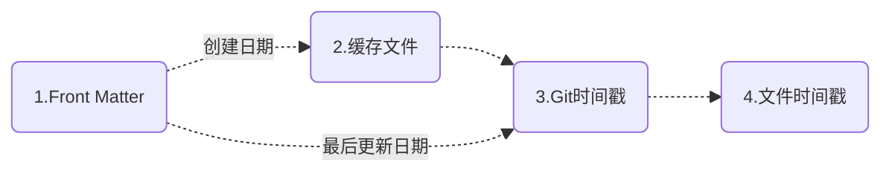
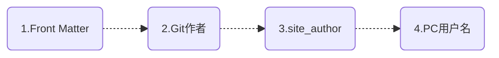
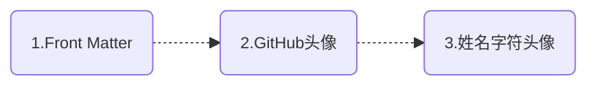

# MkDocs文档日期插件——mkdocs-document-dates


新一代用于显示文档精确元信息的 MkDocs 插件，如**创建时间、最后更新时间、作者、电子邮件**等    


<div class="intro-container">
  <div class="intro-content">
    <div class="intro-text">
      <span class="greeting">仓库地址：<a href="https://github.com/jaywhj/mkdocs-document-dates" class="contributor-link">Aaron</a><span class="wave">👋</span></span>
    </div>
  </div>
</div>

<style>
.intro-container {
  background: linear-gradient(145deg, rgba(255,255,255,0.8) 0%, rgba(240,240,240,0.6) 100%);
  border-radius: 16px;
  padding: 2rem;
  margin: 2rem 0;
  box-shadow: 0 4px 20px rgba(0,0,0,0.05);
  border: 1px solid rgba(200,200,200,0.2);
  transition: all 0.3s ease;
}

.intro-container:hover {
  transform: translateY(-5px);
  box-shadow: 0 8px 25px rgba(0,0,0,0.1);
}

.intro-content {
  display: flex;
  align-items: center;
  justify-content: center;
}

.intro-text {
  text-align: center;
}

.greeting {
  display: block;
  font-size: 1.5rem;
  line-height: 1.6;
  color: #555;
}

.contributor-link {
  color: #608DBD;
  text-decoration: none;
  font-weight: bold;
  padding: 0.2rem 0.4rem;
  border-radius: 6px;
  transition: all 0.3s ease;
}

.contributor-link:hover {
  background-color: rgba(96, 141, 189, 0.1);
  color: #4a7ba7;
  text-decoration: none;
}

.wave {
  display: inline-block;
  animation: wave 1.5s infinite;
  transform-origin: 70% 70%;
}

@keyframes wave {
  0% { transform: rotate(0deg); }
  10% { transform: rotate(14deg); }
  20% { transform: rotate(-8deg); }
  30% { transform: rotate(14deg); }
  40% { transform: rotate(-4deg); }
  50% { transform: rotate(10deg); }
  60% { transform: rotate(0deg); }
  100% { transform: rotate(0deg); }
}

/* 深色模式适配 */
[data-md-color-scheme="slate"] .intro-container {
  background: linear-gradient(145deg, rgba(31,33,40,0.9) 0%, rgba(31,33,40,0.8) 100%);
  border: 1px solid rgba(80,80,80,0.2);
}

[data-md-color-scheme="slate"] .greeting {
  color: #e0e0e0;
}

[data-md-color-scheme="slate"] .contributor-link {
  color: #7BA7D7;
}

[data-md-color-scheme="slate"] .contributor-link:hover {
  background-color: rgba(123, 167, 215, 0.1);
  color: #A8C5E5;
}

/* 移动端适配 */
@media (max-width: 768px) {
  .intro-container {
    padding: 1.5rem;
    margin: 1.5rem 0;
  }

  .greeting {
    font-size: 1.3rem;
  }
}
</style>

## 特性

- 始终显示文档的**精确**元信息，且适用于任何环境（无 Git、Git 环境、Docker 容器、所有 CI/CD 构建系统等）
- 支持列表显示最近更新的文档（按更新日期降序排列）
- 支持在 `Front Matter` 中手动指定日期和作者
- 支持多种日期格式（date、datetime、timeago）
- 支持多种作者模式（头像、文本、隐藏）
- 支持手动配置作者的姓名、链接、头像、邮箱等
- 灵活的显示位置（顶部或底部）
- 优雅的样式设计（完全可定制）
- 智能 Tooltip 悬浮提示
- 多语言支持，本地化支持，智能识别用户语言，自动适配
- 跨平台支持（Windows、macOS、Linux）
- **极致的构建效率**：O(1)，无需设置环境变量 `!ENV` 来区别运行

    | 构建速度对比：                | 100个md： | 1000个md： | 时间复杂度： |
    | --------------------------- | :------: | :-------: | :---------: |
    | git-revision-date-localized<br /><br />git-authors |  <br />＞ 3 s   |  <br />＞ 30 s   |    <br />O(n)    |
    | document-dates              | ＜ 0.1 s  | ＜ 0.15 s  |    O(1)     |

## 安装

```bash
pip install mkdocs-document-dates
```

## 配置

在你的 mkdocs.yml 中添加插件即可：

```yaml
plugins:
  - document-dates
```

或者，完整配置：

```yaml
plugins:
  - document-dates:
      position: top            # 显示位置: top(标题后) bottom(文档末尾), 默认: top
      type: date               # 日期类型: date datetime timeago, 默认: date
      exclude:                 # 排除文件列表
        - temp.md                  # 示例：排除指定文件
        - blog/*                   # 示例：排除 blog 目录下所有文件，包括子目录
      date_format: '%Y-%m-%d'  # 日期格式化字符串（例如: %Y年%m月%d日、%b %d, %Y）
      time_format: '%H:%M:%S'  # 时间格式化字符串（仅在 type=datetime 时有效）
      show_created: true       # 显示创建日期: true false, 默认: true
      show_updated: true       # 显示最后更新日期: true false, 默认: true
      show_author: true        # 显示作者: true(头像) text(文本) false(隐藏), 默认: true
```

## 指定日期时间

### 优先级

插件会按以下顺序**自动加载**文档的创建日期和最后更新日期



<!--
- [x] 创建日期：`Front Matter` > `缓存文件` > `Git时间戳` > `文件时间戳`
- [x] 最后更新：`Front Matter` > `Git时间戳` > `文件时间戳`
-->

!!! quote ""

    === "创建日期"
    
        1. 优先读取 Front Matter 中的自定义创建日期
        2. 其次读取缓存文件中的创建日期
        3. 再次读取文档「首次 git commit 日期」作为创建日期
        4. 最后读取文件的创建时间
    
    === "最后更新日期"
    
        1. 优先读取 Front Matter 中的自定义最后更新日期
        2. 其次读取文档「最近一次 git commit 日期」作为最后更新日期
        3. 最后读取文件的修改时间

### 自定义日期

可在 Front Matter 中通过以下字段手动指定

- 创建日期：`created`, `date`
- 最后更新：`updated`, `modified`

```yaml
---
created: 2023-01-01
updated: 2025-02-23
---
```

### 自动缓存创建日期

插件会自动缓存创建日期（最后更新日期不必缓存），以下是它的原理：

1) 为了始终能获取文档的原始创建日期（早于第一次 git 提交），采用了缓存文件来存储原始创建日期，位于 docs 目录下（默认是隐藏的），请不要删除：

- `docs/.dates_cache.jsonl`，缓存文件
- `docs/.gitattributes`，缓存文件的合并机制

2) 采用了 Git Hooks 机制来自动触发缓存的存储（在你每次执行 `git commit` 时），缓存文件也会随之自动提交，并且 Git Hooks 的安装在插件被安装时也会自动触发，全程无需任何手动干预

- 请确保是从终端执行 `git commit`，而不是从 VSCode 之类的集成工具中，因为这些工具在集成 Git hooks 时存在 bug

回退策略：如果缓存文件不存在或自动缓存失败，创建日期也不会受到影响，它会进入第 3 优先级（读取首次 git commit 日期作为创建日期）

### 适配任意环境

插件在任意环境中均能获取文档的**原始**精准日期，支持无 Git 环境、Git 环境、Docker 容器、所有 CI/CD 构建系统等，以下是它的原理：

1. 采用文件时间戳：确保能在本地无 Git 环境中，获取原始的准确日期
2. 采用 Git 时间戳：确保能在 Git 环境中，获取相对准确的日期
3. 采用缓存文件：确保能在 Git 环境中，获取原始的绝对准确日期
4. Front Matter：如果你不想采用自动化日期，则可以在 Front Matter 中进行个性化自定义

## 指定作者

### 优先级

插件会按以下顺序**自动加载**文档的作者信息，会自动解析邮件后做链接



<!--
- [x] `Front Matter` > `Git作者` > `site_author(mkdocs.yml)` > `PC用户名`
-->

!!! quote ""

    === "顺序说明"
    
        1. 优先读取 Front Matter 中的自定义作者
        2. 其次读取 Git 作者
        3. 再次读取 mkdocs.yml 中的 site_author
        4. 最后读取 PC用户名

### 自定义作者

可在 Front Matter 中通过以下方式配置：

1) 配置一个简单作者：通过字段 `name`

```yaml
---
name: any-name
email: e-name@gmail.com
---
```

2) 配置一个或多个作者：通过字段 `authors`

```yaml
---
authors:
  - jaywhj
  - dawang
  - sunny
---
```

### 增强作者配置

可为所有作者补充完整信息配置，以丰富用户体验。在 `docs/` 目录下创建一个 `authors.yml` 文件，格式参考：

```yaml title="docs/authors.yml"
authors:
  jaywhj:
    name: Aaron Wang
    avatar: https://xxx.com/avatar.jpg
    url: https://jaywhj.netlify.app/
    email: junewhj@qq.com
    description: Minimalism
  user2:
    name: xxx
    avatar: assets/avatar.png
    url: https://xxx.com
    email: xxx@gmail.com
    description: xxx
```

当 `Front Matter`、`Git作者`、`site_author(mkdocs.yml)` 中的作者名跟 authors 中的 key 匹配时，会自动加载 key 对应的完整作者信息

### Git作者聚合

Git作者支持账户聚合，即同一人的多个不同邮箱账户可聚合显示为同一作者，可通过在仓库根目录提供一个 `.mailmap` 文件来配置，详情见 [gitmailmap](https://git-scm.com/docs/gitmailmap)

以下示例将 gmail 账户聚合到 qq 账户，统一显示为 Aaron：

```yaml title=".mailmap"
Aaron <junewhj@qq.com> <aaron@gmail.com>
```

## 指定头像

**优先级**：插件会按以下顺序**自动加载**作者头像



<!--
- [x] `Front Matter` > `GitHub头像` > `姓名字符头像`
-->

**自定义**：

可通过 [增强作者配置]中的 `avatar` 字段进行自定义（支持 URL 路径和本地文件路径）

**其它**：

!!! quote ""

    === "GitHub头像"
    
        解析 mkdocs.yml 中的 `repo_url` 属性自动加载，无需单独配置
    
    === "姓名字符头像"
    
        根据作者姓名自动生成，规则如下：
        1. 提取 initials：英文取首字母组合，中文取首字
        2. 生成动态背景色：基于名字哈希值生成 HSL 颜色

## 设置插件样式

可通过预置入口快速设置插件样式，比如**图标、主题、颜色、字体、动画、分界线**等，你只需要找到下方文件取消里面的注释即可：

|    类别：    | 位置：                                         |
| :---------: | --------------------------------------------- |
| **样式与主题** | docs/assets/document_dates/user.config.css |
| **属性与功能** | docs/assets/document_dates/user.config.js  |


## 添加本地化语言

插件的 `tooltip` 和 `timeago` 内置了多语言支持，并且会自动识别 `locale`，无需手动配置。如有语言缺失，则可为它们补充：

**tooltip**

内置语言：`en zh zh_TW es fr de ar ja ko ru nl pt`

补充方式（2选1）：

- 在 `user.config.js` 中，参考 [Part 3](https://github.com/jaywhj/mkdocs-document-dates/blob/main/mkdocs_document_dates/static/config/user.config.js)，自行注册添加
- 提交 PR 以供纳入

**timeago**

当设置 `type: timeago` 时，将启用 timeago.js 库以进行动态时间渲染，`timeago.min.js` 内置的语言仅包含 `en zh`，如需加载其他语言，可以按如下方式配置（2选1）：

- 在 `user.config.js` 中，参考 [Part 2](https://github.com/jaywhj/mkdocs-document-dates/blob/main/mkdocs_document_dates/static/config/user.config.js)，自行注册添加
- 在 `mkdocs.yml` 中，配置 full 版本的 `timeago.full.min.js`，一次性重载 [所有区域语言](https://github.com/hustcc/timeago.js/tree/master/src/lang)
    ```yaml
    extra_javascript:
      - assets/document_dates/core/timeago.full.min.js
    ```

## 使用模板变量

你可以在模板中使用如下变量访问文档的元信息：

- page.meta.document_dates_created
- page.meta.document_dates_updated
- page.meta.document_dates_authors
- config.extra.recently_updated_docs

应用示例：

- **示例1**：为你站点的 sitemap.xml 设置正确的 `lastmod`，以便搜索引擎能更好的处理 SEO，从而提高你网站的曝光率（下载 [sitemap.xml](https://github.com/jaywhj/mkdocs-document-dates/blob/main/templates/overrides/sitemap.xml) 后覆盖：`docs/overrides/sitemap.xml`）
- **示例2**：利用模板重新定制插件，你可以完全掌控渲染逻辑，插件只负责提供数据（下载模板文件 [source-file.html](https://github.com/jaywhj/mkdocs-document-dates/blob/main/templates/overrides/partials/source-file.html) 后覆盖：`docs/overrides/partials/source-file.html`，然后自由定制模板代码）

## 添加最近更新模块

可在任意模板中通过 `config.extra.recently_updated_docs` 变量获取最近更新的文档数据（按更新日期降序排列），然后自行定制渲染逻辑

或者参考以下示例，直接使用预设模板（列表标题和链接将自动渲染）：

### 添加到侧边栏导航中

1) 在 `mkdocs.yml` 中配置开关 recently-updated：
    ```yaml
    - document-dates:
        ...
        recently-updated:
            limit: 10        # 限制显示的文档数量
            exclude:         # 排除不想显示的文档
              - index.md
              - blog/*
    ```

2) 下载 [nav.html](https://github.com/jaywhj/mkdocs-document-dates/blob/main/templates/overrides/partials/nav.html) 后覆盖 `docs/overrides/partials/nav.html`

### 添加到文档的任意位置

1) 在 `mkdocs.yml` 中配置开关 recently-updated：
    ```yaml
    - document-dates:
        ...
        recently-updated:
            limit: 10        # 限制显示的文档数量
            exclude:         # 排除不想显示的文档
              - index.md
              - blog/*
    ```

2) 在文档中任意位置插入这一行：
    ```yaml
    <!-- RECENTLY_UPDATED_DOCS -->
    ```

### 效果预览


如果你只想使用「最近更新模块」，也可以安装单独的插件 [mkdocs-recently-updated-docs](https://github.com/jaywhj/mkdocs-recently-updated-docs)

## 其它提示

在 Docker 中运行时，需要先设置 HOME 环境变量，因为安装 Git Hooks 需要一个可写的用户配置目录。例如，在你的 `docker-compose.yml` 中添加以下配置：

```yaml
environment:
  - HOME=/docs
working_dir: /docs
volumes:
  - ./mkdocs:/docs    # 将宿主机的 ./mkdocs 挂载到容器中的 /docs
```

## 开发小故事

一个可有可无、微不足道的小插件，没事的朋友可以看看 \^\_\^ 

- **起源**：
    - 是因为 [git-revision-date-localized](https://github.com/timvink/mkdocs-git-revision-date-localized-plugin) ，一个很棒的项目。在2024年底使用时，发现我这本地用不了，因为我的 mkdocs 文档没有纳入 git 管理，然后我就不理解为什么不读取文件时间戳，而要用 git 时间戳，而且文件时间戳更准确，还给作者提了 issue，结果等了一周左右没得到回复（后面作者回复了，人不错，估计他当时在忙没来得及），然后就想，过年期间没啥事，现在 AI 这么火，要不借助 AI 自己试试，就诞生了，诞生于2025年2月
- **迭代**：
    - 开发后，就理解了为什么不采用文件时间戳，因为文件在经过 git checkout 或 git clone 时会被重建，从而导致克隆或检出后的分支/文件的原始时间戳丢失，解决办法有很多：
        - 方法 1，采用最近一次 git commit 日期作为文档的最后更新日期，采用首次 git commit 日期作为文档的创建日期，`git-revision-date-localized` 就是这么做的（这种方式，存在一定的误差且无法在无Git环境中使用）
        - 方法 2，可以提前缓存原始日期，后续读缓存就可以了（日期准确且不依赖任何环境）。缓存的地方，可以是源文档的 Front Matter 中，也可以是单独的文件，我选择了后者。存储在 Front Matter 中非常合理且更简单，但是这样会修改文档的源内容，虽然对正文无任何影响，但是我还是想保证数据的原始性
- **难点**：
    1. 什么时候去读取和存储原始日期？这只是 mkdocs 的一个插件，入口和权限非常有限，mkdocs 提供的只有 build 和 serve，那万一用户不执行 build 或 serve 而直接 commit 呢（比如使用 CI/CD 构建系统时），那样你就无法获取文件的日期了，更别说缓存了
        - 直接说结论：利用 Git Hooks 机制，能在特定的 git 动作发生时触发自定义脚本，比如每次 commit 时
    2. 如何自动安装 Git Hooks？在何时？怎么触发？通过 pip 从 PyPI 安装包并没有标准的 post-install 钩子机制
        - 我的方案：分析了 pip 从 PyPI 安装包的流程，发现通过源码包编译安装时（sdist），会调用 setuptools 来处理，那么可以在 setuptools 的流程中想办法植入安装脚本，即在 setup.py 中添加自定义脚本
    3. 跨平台的 hook 怎么设计？执行 python 脚本，需要明确指定 python 解释器，而用户的 python 环境，因操作系统、python 的安装方式以及配置的不同而各不相同，如何才能保证在所有环境下都能正常运行？
        - 解决办法：不要在 hook 中再去判断用户的 python 环境，因为为时已晚。你可以在安装钩子之前就这样做，然后动态设置 hook 的 shebang 行，从而设置正确的 python 解释器
    4. 在多人协作时，如何保证单独的缓存文件不冲突？
        - 我的方案：采用 JSONL 代替 JSON，配合并集的合并策略 `merge=union`
    5. 在文档较多时( > 200 )，如何降低 build 用时？通常每次获取 git 信息都是一次文件 I/O 操作，如果文件较多，就会大大影响构建速度，这让用户没法忍受（比如，`git-revision-date-localized` 只能通过添加环境变量 `enabled: !ENV` 在本地禁用自己来提高预览速度，这有点掩耳盗铃的感觉）
        - 解决办法：减少 I/O 次数 + 替换运行效率较低的系统函数
- **精进**：
    - 既然是新开发的插件，那就奔着**优秀产品**的方向去设计，追求极致的**易用性、简洁性、个性化、智能化**
        - **易用性**：无复杂配置，常用的配置项也就 2-3 条，另外为个性化配置提供了模板
        - **简洁性**：无任何不必要的配置，无 Git 依赖，无 CI/CD 配置依赖，无其他包依赖
        - **个性化**：可完全自定义插件，完全掌控渲染逻辑，插件只负责提供数据
        - **智能化**：智能解析文档日期、作者、头像，智能识别用户语言并自动适配，此外，还有自动安装 Git Hooks、自动缓存、自动 commit 等
        - **兼容性**：兼容旧版操作系统和浏览器，如 WIN7、MacOS 10.11、iOS 12、Chrome 63.0.3239
- **最后的秘密秘密 🤐**：
    - 编程是爱好，我是一名从业八年的市场营销人员（欢迎留言）