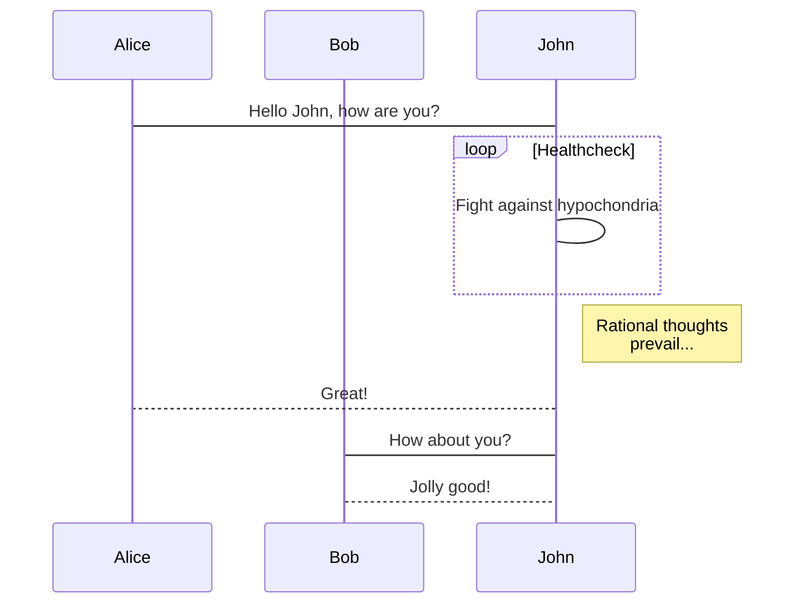

---
title: Markdown写作应用推荐
tags:
  - Markdown
---  

<b>MWeb Pro </b>是一款适用于macOS的专业Markdown写作、笔记本应用软件。喜欢写博客的朋友，那你一定会需要 MWeb Pro 这款软件。为您提供最佳的写作体验。

Markdown 语法支持：

使用 Github Flavored Markdown 语法，简称 GFM 语法。支持表格、TOC、LaTeX、代码块、任务列表、脚注等。画图库支持 mermaid, viz, echarts, plantuml, sequence, flow。

辅助功能

支持截图并粘贴、复制并粘贴、拖拽等方式插入图片并直接显示在编辑器内。在兼容 Markdown 语法的情况下支持设置图片宽度。好用的表格插入和 LaTeX 书写辅助。

输出功能

支持导出为图片、HTML、Epub、PDF、RTF、Docx。支持发布到 Wordpress、印象笔记、Blogger、Medium、Tumblr等。支持七牛云、又拍云等以及自定义的图床服务。

强大的笔记功能

强大的文档库支持分类树和标签管理文档，文档可归类于多个分类，可以把分类整个导出为 Epub、PDF 和生成静态网站。非常合适用于笔记、个人知识收集、管理和输出。 快速笔记：随意增加笔记及图片等素材，支持以天为单位把增加的素材组合在一个文档内，方便整理及记录历史收集情况。快速搜索：目前已支持全局快捷键调出搜索。

***
以下摘自MWeb关于Markdown的介绍

## 欢迎使用 MWeb

MWeb 是专业的 Markdown 写作、记笔记、静态博客生成软件，目前已支持 Mac，iPad 和 iPhone。MWeb 有以下特色：

## 软件本身：

* 使用原生的 macOS 技术打造，追求与系统的完美结合。
* 原则上，首先是追求界面简洁和高性能，然后才是强大易用，功能全面。

## Markdown 语法：

* 使用 GitHub Flavored Markdown 语法，简称 GFM 语法。
* 支持表格、TOC、LaTeX、代码块、任务列表、脚注等。
* 画图库支持 mermaid, viz, ECharts, PlantUML, Sequence, Flow。

## Markdown 辅助：

* 支持截图并粘贴、复制并粘贴、拖拽等方式插入图片并直接显示在编辑器内。
* 在兼容 Markdown 语法的情况下支持设置图片宽度。
* 好用的表格插入和 LaTeX 书写辅助。

## Markdown 输出：

* 支持导出为图片、HTML、Epub、PDF、RTF、Docx。
* 支持发布到 WordPress、支持 Metaweblog API 协议的服务、Wordpress.com、印象笔记（Evernote）、Blogger、Medium、Tumblr、语雀、Ghost、少数派 Matrix。
* 图片上传服务（图床）支持 Imgur、七牛云、又拍云、腾讯云 COS、阿里云 OSS、SM.MS和自定义的图床服务。

## Markdown 笔记：

* 强大的文档库支持分类树和标签管理文档，文档可归类于多个分类，可以把分类整个导出为 Epub、PDF 和生成静态网站。非常合适用于笔记、个人知识收集、管理和输出。
* 快速笔记：随意增加笔记及图片等素材，支持以天为单位把增加的素材组合在一个文档内，方便整理及记录历史收集情况。
* 快速搜索：目前已支持全局快捷键调出搜索。

## 外部 Markdown 文档：

* 外部 Markdown 文档使用外部模式管理。外部模式使用目录树的方式编辑和管理你的 Markdown 文档，还能很好的支持 GitBook、Jekyll、Hexo 等等编辑和图片插入。

## MWeb 文档：

如果要更详细了解 MWeb，建议你一定要去看一下官网的帮助文档，网址为：<https://zh.mweb.im/help.html>。我们建议在使用文档库之前，一定要阅读一下 [MWeb 文档库详细介绍](https://zh.mweb.im/mweb-library.html) 这篇文章，以便更好的使用文档库。

## 帮助我们改进 MWeb

如果你喜欢 MWeb，想让它变得更好，你可以：

1. 推荐 MWeb，让更多的人知道。
2. 给我们发反馈和建议：<coderforart+2333@gmail.com>
3. 在 Mac App Store 上评价 （如果是在 MAS 上购买的话）。


## GFM 语法简介和 MWeb 所支持的扩展语法

### 回车转为换行

官方的语法规定结尾加 2 个以上空格加换行才会转成换行，也就是 `<br />` 标签。MWeb 中有个选项可以直接把换行转成 `<br />`，不用加上 2 个以上空格，这个选项默认是开启的。如果要关闭，请在设置页面关闭。

### 任务列表（Task lists）

Markdown 语法：

```
- [ ] 任务一 未做任务 `- + 空格 + [ ]`
- [x] 任务二 已做任务 `- + 空格 + [x]`
```

效果如下：

- [ ] 任务一 未做任务 `- + 空格 + [ ]`
- [x] 任务二 已做任务 `- + 空格 + [x]`

### 图片大小及对齐

官方和 GFM 都不支持图片大小设置，MWeb 引入的特别的语法来设置图片宽度。如：`` 这样表示设置图片宽度为 450。其中 -w450 为设置语法，生成 HTML 时会自动移除。w 表示设置宽度。 可以看出，MWeb 引入的语法的特点是兼容原来的语法和仅支持设置宽度。


### 多行或者一段代码

Markdown 语法：

	```js
	function fancyAlert(arg) {
	  if(arg) {
	    $.facebox({div:'#foo'})
	  }

	}
	```
	
效果如下：

```js
function fancyAlert(arg) {
	if(arg) {
		$.facebox({div:'#foo'})
	}

}
```

这个语法目前在 MWeb 中使用，必须前后空一行，才会正确解析。我觉得，在写 Markdown 文档过程中，运用空行很有必要，基本上，块级元素（标题、列表、引用、代码块、表格、段落等），都建议前后空一行。

### 表格

Markdown 语法：

```
第一格表头 | 第二格表头
--------- | -------------
内容单元格 第一列第一格 | 内容单元格第二列第一格
内容单元格 第一列第二格 多加文字 | 内容单元格第二列第二格
```

效果如下：

第一格表头 | 第二格表头
--------- | -------------
内容单元格 第一列第一格 | 内容单元格第二列第一格
内容单元格 第一列第二格 多加文字 | 内容单元格第二列第二格


### 删除线

Markdown 语法：

	加删除线像这样用： ~~删除这些~~

效果如下：

加删除线像这样用： ~~删除这些~~

### LaTeX

Markdown 语法：

	块级公式：
	```math
	x = \dfrac{-b \pm \sqrt{b^2 - 4ac}}{2a}
	```

	行内公式： ``\Gamma(n) = (n-1)!\quad\forall n\in\mathbb N``


效果如下（在设置页面中启用 LaTeX 才会看到效果）：

块级公式：

```math
x = \dfrac{-b \pm \sqrt{b^2 - 4ac}}{2a}
```

行内公式： ``\Gamma(n) = (n-1)!\quad\forall n\in\mathbb N``

<!-- 注意：为了兼容 MWeb 3，也支持 $\Gamma(n) = (n-1)!\quad\forall n\in\mathbb N$ 
和块级语法
$$	x = \dfrac{-b \pm \sqrt{b^2 - 4ac}}{2a} $$
但是建议用新的语法。 -->

## MWeb 画图

### mermaid

mermaid 是比较流行的画图库，它支持流程图、顺序图和甘特图，它的官网为：<https://mermaidjs.github.io/> ，在 MWeb 中使用 mermaid 的语法就是声明代码块的语言为 mermaid，代码块中再写上 mermaid 的画图语法即可，你可以把下面的语法复制到 MWeb 中查看效果。

    ```mermaid
    sequenceDiagram
        participant Alice
        participant Bob
        Alice->John: Hello John, how are you?
        loop Healthcheck
            John->John: Fight against hypochondria
        end
        Note right of John: Rational thoughts <br/>prevail...
        John-->Alice: Great!
        John->Bob: How about you?
        Bob-->John: Jolly good!
    ```
 
**效果如下：**
 

### echarts

echarts 是百度出品的 js 画图库，它的网址为：<https://echarts.apache.org/zh/index.html>，功能非常强大，MWeb 支持 echarts 的一些基本的用法，太高级的不支持。你可以将以下语法复制到 MWeb 中进行尝试。你也可以去 <https://echarts.apache.org/examples/zh/index.html> 这个网址查看一些例子，要注意的是 MWeb 只能解析 `option = {}` 这种简单的，不过应该是足够使用了。

    ```echarts
    option = {
        xAxis: {
            type: 'category',
            data: ['Mon', 'Tue', 'Wed', 'Thu', 'Fri', 'Sat', 'Sun']
        },
        yAxis: {
            type: 'value'
        },
        series: [{
            data: [820, 932, 901, 934, 1290, 1330, 1320],
            type: 'line'
        }]
    };
    ```

**效果如下：**

```echarts
option = {
    xAxis: {
        type: 'category',
        data: ['Mon', 'Tue', 'Wed', 'Thu', 'Fri', 'Sat', 'Sun']
    },
    yAxis: {
        type: 'value'
    },
    series: [{
        data: [820, 932, 901, 934, 1290, 1330, 1320],
        type: 'line'
    }]
};
```


### 脚注（Footnote）

Markdown 语法：

```
这是一个脚注：[^1]
```

效果如下：

这是一个脚注：[^1]

[^1]: 这里是脚注信息


### 注释和阅读更多

<!-- comment -->
<!-- more -->

**注** 阅读更多的功能只用在文档库生成静态网站或发布到 Wordpress 博客时，插入时注意要后空一行。


